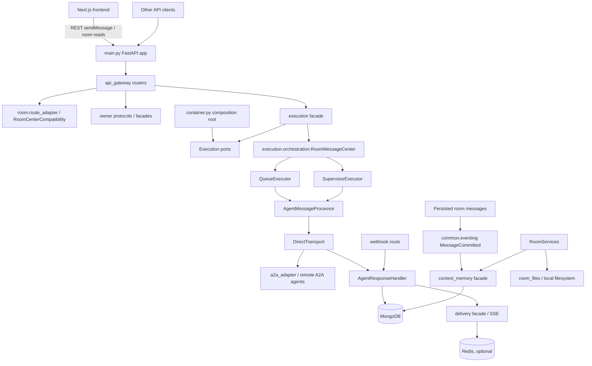

# System Architecture

## Typed interactive agent ingress

All remote `input-required`/interactive events now cross a single
`AgentIngressRouter` boundary before any public task, message, artifact, or SSE
projection. Transports capture a private `AgentInputObservation` directly from
an authoritative A2A `Task` or `TaskStatusUpdateEvent`; only
`status.message.metadata["hybro.ai/a2a/interaction"]` is parsed as the typed
contract.

The router resolves ownership exclusively from the persisted
`RoomAgentMessage.run_id`. A verified Supervisor dispatch CAS-appends an
idempotent private observation to `OrchestrationRunState` and re-enters normal
recovery without exposing the remote prompt. Conversation-owned typed events
first persist their queue continuation, then materialize one R1 A2A-resume
interaction aggregate, and only then project its typed question inventory.
Absent or invalid typed metadata fails with `unsupported_interaction` and the
fixed public message `The agent requested an unsupported interaction.`


## Orchestrator A2A runtime

The orchestrator runtime currently remains outside `container.py`, routes,
and jobs until the production cutover. Contracts pinned before wiring:

- `OrchestratorRunState` (schema version 5) persists an explicit
  `runtime_generation` (always `"orchestrator"` in this store) fixed at Run
  creation and never re-evaluated; legacy-owned Runs are identified by their
  absence from this store. Production dual routing and recovery must key off
  this persisted ownership, never off a live feature flag.
- `ProfileConfiguration.initial_routing` and `finalization` are frozen per Run
  but reserved: no code consumes them yet. Production composition pins
  `explicit_agent_first` (API pre-filters the candidate scope) and
  `pass_through` (final assistant message delivered unchanged);
  `model_select` and `synthesize` are deferred product capabilities.
- The `orchestrator_run_events` inventory now has both an in-memory and a
  Mongo `OrchestratorEventStore` implementation behind the pure
  `evaluate_event_append` ordering/idempotency evaluation; the Mongo store
  relies on the `(event_id)` and `(run_id, sequence)` unique indexes to
  classify concurrent insert losers as replay or conflict. Event persistence
  identity canonicalizes only `created_at` to UTC BSON millisecond precision;
  all other identity, sequence, and state-version fields remain exact. Terminal
  event intents are minted in that form, while both stores and the Mongo
  duplicate-winner boundary normalize legacy microsecond payloads before replay
  comparison.
- The artifact write-lease owner `orchestrator-v3-a2a-artifact` and the
  `orchestrator-v3-a2a` origin-key namespace are durable operational/data
  identity and must survive the version-neutral naming cleanup unchanged.

Its durable adapter boundary translates only retryable provider
persistence failures into `RecoverableAdapterError`; checkpoint,
authorization, epoch, resource, transport, and ambiguous-effect adapters use
narrow typed subclasses. Contract and programming errors (`ValueError`,
`TypeError`, assertion failures, and unexpected runtime failures) remain
visible. Accepted execution converts only those typed outages into recoverable
suspension or reconciliation so a remote effect cannot compete with a generic
tool failure.

Observation ingress resolves the frozen call or authoritative alias before the
immutable inbox insert. Every accepted inbox and conflict row therefore carries
its Room ID and epoch at creation; unresolvable evidence is rejected before it
can evade Room-epoch cleanup. HITL authorization proofs bind the call and Room
identity plus interaction ID/revision, route and interaction fingerprints,
question/challenge identity, and answer digest. Consumed reference digests are
retained on the call so a later challenge cannot reuse the same reference. An
exact retry validates the durable answer, route, marker, answerer, proofs, and
continuation outcome before returning the existing state without another
command. Input/auth inbox processing classifies the durable call winner at both
the continuation-pending and interaction-attach CAS boundaries. A terminal
winner completes the inbox without suspension delivery; any aggregate created
before the losing attach is durably abandoned and excluded from interaction
reads. Activation is followed by an authoritative call reload: only the exact
state, interaction ID, revision, and fingerprint may emit a suspension. Every
later terminal producer closes the attached interaction through the shared
`TerminalInteractionFinalizer` before coordinator return, terminal sink, inbox
completion, or any `A2AAgentToolRuntime` terminal `ToolResult`. Runtime replay,
persisted-outcome, inline terminal, and competing-CAS-winner paths suspend on a
typed closure failure and retry the durable terminal winner without repeating
the transport effect. Observation, cancellation, continuation, and runtime
reads/answers therefore remain terminal-monotonic. Activation renews and verifies
the Room epoch immediately
before and after the owner effect; inactive-epoch cleanup must close the exact
prepared/attached interaction before consuming the inbox. Explicit absent
abandonment is an idempotent no-op; owner errors and typed outages keep cleanup
retryable. General recovery compares semantic state, attempts, result, and future
schedule rather than lease/version churn; orphan acceptances schedule at their
TTL, dispatch failures use bounded backoff, and a per-record outage cannot abort
the remaining recovery scan.

Direct transport capability selection (`stream`, `sync`, or `poll`) is frozen
in the accepted dispatch snapshot. The provider-neutral direct client port
contains SDK types behind its implementation boundary. Every direct operation
resolves and validates the Agent Card before its remote message/cancel effect.
Card fetch status `408`/`425`/`429`/`5xx` and recognized no-status network
failures become a sanitized `RecoverableTransportError`; initial dispatch,
continuation, and cancellation return to their retry-safe pre-effect state and
reuse the frozen command/message ID under `max_transport_attempts`. Background
`ready_to_dispatch` recovery reloads the exact durable invocation and re-enters
`A2AAgentToolRuntime.execute`; it never calls the transport directly, so claim,
attempt, receipt, observation, backoff, and terminal-result CAS accounting are
identical to foreground execution. Inspection retries inspection, and transient
model replies remain suspended for their existing bounded kernel recovery. A
`401`/`403`/`404` or invalid Card becomes the non-retryable
`AgentCardContractError` and terminalizes the durable call and `ToolResult`
together. For model-reply continuation, that permanent failure terminalizes the
parent call and abandons its exact interaction before the join failure is
returned. Sanitized Card exceptions sever the raw provider exception chain, so
endpoint or credential text is not reachable through `__cause__`/`__context__`.
Thus public tool failure cannot disagree with a nonterminal ledger row. Stream
events enter the same durable ingress before they affect
lifecycle state; deadline, cancellation, and process-death paths close the stream
and reconcile through inspection.
Inbound remote artifacts may be enabled only with the guarded adapter, which
uses the existing SSRF-pinned fetch primitive and an epoch-fenced
`RoomFilesEpochFencedArtifactOwner`. After a long fetch, that owner holds the
existing Room deletion/write lease while checking the exact Room epoch and
committing; a recreated Room cannot receive an old-incarnation artifact. Room
epoch activation/deactivation replay uses creation/deletion identity and the
winner's timestamp rather than caller timestamp equality.

This document describes the current architecture and core workflows of the
canonical backend in this repository's `backend/` directory. It focuses on code
currently present in this repository.

## High-Level Shape

The backend is a FastAPI monolith that coordinates:

- A web app API for rooms, agents, messages, HITL, files, and SSE.
- A2A agent communication, including synchronous, streaming, and webhook-based
  long-running task updates.
- Context memory projection, search, and compaction.
- Cross-instance SSE delivery, Execution-owned cancellation, and background recovery jobs.

The application entry point is `main.py`. Dependency construction is centralized
in `container.py`, while request routers live under `api_gateway/routes`.

At runtime the system follows this broad layering:



## Runtime Entry Point

`main.py` creates the FastAPI app, configures the stdout-only structured
logging pipeline, installs request correlation/logging middleware, installs
middleware, mounts `api_gateway.router`, and delegates runtime assembly to
container-owned entrypoints:

- `create_application_runtime(settings)`
- `startup_runtime(app, runtime)`
- `validate_runtime_bindings(app, runtime)`
- `shutdown_runtime(app, runtime)`

Startup has three practical phases:

1. Infrastructure setup:
   - Load settings and auth configuration.
   - `container.py` builds `MongoDAL`, Redis, local file-content
     adapters, facades, repositories, route dependencies, and owner-module
     runtime adapters.

2. Runtime guard and background services:
   - Start the Execution cancellation runtime, then Delivery/SSE runtime.
   - Probe DAL Redis KV and Streams runtime services when `REDIS_URL` is configured.
   - Enforce multi-worker safety with `check_multi_worker_safety`.
   - Start background jobs after the guard passes.

3. Serving and normal shutdown:
   - Verify all required bindings in `validate_runtime_bindings`. The final
     composition-root check aggregates Execution, API gateway, and Room core
     readiness; each lifespan first resets the process-global Room runtime, then
     Room reports missing store, facade, cancellation, parser, user-message
     commit, timeline, deletion, and agent-preparation bindings before traffic
     is served. Explicitly degradable attachment/context
     capabilities do not fail startup.
   - Serve `/health` and `/api/v1/*`.
   - On shutdown, stop jobs and in-flight execution, then stop internal eventing
     before Delivery/SSE, cancellation, Redis, and MongoDB.
     Cleanup stages are failure-isolated: the first error is preserved while
     later resource owners still receive their close call. Startup rollback uses
     the reverse dependency order and bounds every cleanup stage with owned tasks
     plus `asyncio.wait`; a cancellation-resistant close is detached observably
     without blocking later Eventing/Delivery cleanup.

The application router is mounted from `api_gateway.router` under the configured
API prefix, defaulting to `/api/v1`.

## Dependency Assembly

`container.py` is the main composition root. It creates strongly typed dependency
groups around protocol interfaces from `common.protocols`:

- `AgentDeps`
- `RoomDeps`
- `DeliveryDeps`
- `ExecutionDeps`

The codebase is built around facade/protocol boundaries.

Runtime composition now follows:

```text
route -> protocol/facade -> repository/DAL -> external service
```

Examples:

- Room CRUD, membership, user-message persistence/preflight, and route-shaped
  room behavior remain in `room.compat.runtime`, `room.route_adapter`, and
  `room.membership_source`. From the former compatibility execution-service
  bundle, the runtime retains only the narrow cancellation-control port for
  message token lifecycle; it does not own Delivery, A2A, agent selection, agent
  compatibility, or remote-task-reader dependencies. Outbound agent-message
  preparation is owned by
  `room.agent_message_preparation.AgentMessagePreparationService`; the
  compatibility runtime keeps only a signature-preserving delegate. Public room
  timeline projection is owned by `room.timeline_projection.RoomTimelineProjector`.
  It receives already-queried timeline pages and uses narrow, room-scoped file
  metadata and HITL readers to produce safe public messages without mutating
  repository models; request validation, cursor handling, and queries remain in
  the compatibility runtime. Room deletion orchestration is owned by
  `room.deletion.RoomDeletionService`, which preserves the compatibility response
  contract while coordinating owner validation, file write draining, phased
  cleanup, Context Memory cleanup, and final deletion through narrow ports.
- Agent route compatibility is owned by `agent.route_adapter.AgentRouteAdapter`
  and `agent.service.AgentService`, both constructed directly by `container.py`
  over `agent.AgentFacade`.
- A2A compatibility-shaped runtime behavior lives in
  `a2a_adapter.runtime_service`. A2A SDK transport/coercion work stays in
  `a2a_adapter`, while task-tracking behavior and persistence remain
  Execution-owned. `container.py` constructs `A2ATaskTrackingService` and injects
  it through the adapter-owned `A2ATaskTrackingPort`; `a2a_adapter` does not
  import `execution`, so the package dependency remains one-way.

Execution is intentionally independent from removed-package compatibility
objects.
`container.py` wires owner modules such as `a2a_adapter.runtime_service`,
`room.compat.runtime`, `room.agent_message_preparation`, `room.deletion`,
`room.timeline_projection`, Delivery/SSE, room memory, Delivery task notifier,
and
`dal.runtime_store` objects into focused execution ports. Files under
`execution/` do not accept broad compatibility-store aggregates. Queue,
supervisor, dispatch, HITL, cancellation, and webhook resume paths receive only
the methods they call through execution-owned protocols in `execution/ports.py`.

Agent dependency assembly is also container-owned. `container.py` constructs
`AgentService`, `AgentRouteAdapter`, `AgentMatcher`, `AgentSelectionService`,
`AgentResolverService`, `AgentHealthService`, `AgentLivenessService`, and
`AgentInspectionService` from `agent/`; `APIGatewayDeps` receives these
Agent-owned protocol implementations directly. Agent runtime behavior is owned
by `agent/`.

`local_agents/` owns Docker-host discovery without owning Agent persistence or
execution. When enabled, its in-process service scans the configured
`host.docker.internal` port range at startup and every 120 seconds, probes Agent
Cards through the SDK-confined `a2a_adapter` resolver, and reconciles results
through the Agent registry writer. Discovered records use `source=local`, remain
public and directly callable. Scheduled discovery marks them inactive after
three successful cycles in which they are absent; the authenticated
`POST /api/v1/local-agents/discovery` manual refresh immediately reconciles
missing agents and upgrades any in-flight cycle to a manual refresh. This first
phase targets the single-process Docker Compose backend; discovery coordination
and miss counters are intentionally process-local.

## Major Code Areas

### `api_gateway`

`api_gateway/router.py` registers all API route modules; the route modules are
thin FastAPI wrappers that parse requests, run auth checks, and delegate to
bound dependencies.

Important route groups:

- `room_routes.py`: room CRUD, room messages, active runs, `sendMessage`.
- `agent_routes.py`: agent registration, lookup, update, visibility, and the
  authenticated local-agent discovery trigger.
- `agent_group_routes.py`: saved agent groups.
- `sse_routes.py`: room SSE stream, SSE status, message cancellation.
- `hitl_routes.py`: human-in-the-loop request and response APIs.
- `files_routes.py`: file upload for room message attachments.
- `webhook_routes.py`: A2A task webhook callbacks.

Saved Team creation accepts an optional owner-scoped `preset_key`. The gateway
maps it to a deterministic `group_id`, returns an existing Team for repeated
requests, and recovers the winning row when concurrent inserts race. A critical
unique Mongo index on `agent_groups.group_id` makes this idempotency guarantee
atomic across processes and browser tabs; ordinary Team creation without a
preset key keeps random IDs.

Frontend-facing routes use Clerk auth when `AUTH_MODE=clerk`. In the default
self-hosted `AUTH_MODE=mock` mode, `main.py` overrides every user-auth dependency,
including the dual user/service dependency used by agent registration, with the
stable local developer identity.

### `common`

`common` holds cross-cutting primitives:

- `common.dto`: immutable data transfer objects used across module boundaries.
- `common.protocols`: structural interfaces for facades, repositories, delivery,
  execution, platform, LLM, and DAL dependencies.
- `common.config.settings`: environment-backed settings.
- `common.errors`: typed domain/platform errors.
- `common.utils`: time, A2A helpers, context utilities, streaming helpers, and a
  side-effect-free compatibility import for the logging API.
- `common.observability`: process logging, correlation context, tracing, and
  metrics helpers. See [Observability.md](Observability.md).
- `common.a2a_task_projection`: common-owned, persistence-safe public projection
  of A2A tasks, messages, parts, and artifacts. API routes and runtime modules
  share this privacy boundary without importing one another's implementations.

When adding new boundaries, prefer using `common.protocols` instead of importing
concrete runtime singletons.

- `common.protocols.runtime_store_protocols` is now a leaf-package contract
  surface. It exposes common-owned runtime DTOs from
  `common.dto.runtime_store`; runtime-store adapters convert those DTOs to
  legacy `models.*` instances before calling focused persistence stores, so
  legacy models no longer cross the `common.protocols` boundary.
- Runtime-store aggregate ports are assembled in `container.py` and remain
  legacy-model shaped where production consumers still require those models.
  New common protocols should stay DTO-shaped.

#### Runtime Configuration

Runtime application code reads environment-backed configuration through
`common/config/settings.py`. On the host, Settings loads the monorepo-root
`.env` when that file exists (never together with a leftover `backend/.env`,
which would otherwise override root values). If the root file is absent,
Settings falls back to `backend/.env`. Under Docker Compose, process
environment from the root `.env` `env_file` (plus Compose overrides) is
authoritative. Default-agent and registrar containers do **not** receive the
full root env; Compose interpolates only an allowlisted subset
(`OPENAI_API_KEY`, `OPENAI_MODEL`, `IMAGE_MODEL`, `IMAGE_SIZE` for agents;
`AGENT_REGISTRAR_TOKEN` for the registrar). The frontend image receives
`NEXT_PUBLIC_*` values as Docker build args (baked into the client bundle)
and only `BACKEND_URL` plus server-side Clerk secrets at runtime. Raw `os.getenv()`, `os.environ.get()`, and
`os.environ[...]` reads are reserved for the canonical settings module; the
config unification gate in `tests/test_config_unification_gate.py` scans tracked
production Python files and fails on new raw env reads outside that file.

The gate intentionally excludes `tests/`, `scripts/`, and `docs/`: tests may
set env vars to verify settings loading, while scripts run outside the app
runtime. `SERVER_SOFTWARE` is exposed as the live `Settings.is_gunicorn`
property because it is server-injected runtime metadata, not user application
configuration.

#### A2A Inline File Dispatch Policy

Under the active attachment policy, user-uploaded files sent to agents are
read from the room file store and dispatched as A2A `FileContent.bytes`.
Local filesystem paths and authenticated room-file URLs remain internal to
Hybro and are never sent to agents.

`A2A_INLINE_FILE_MAX_RAW_BYTES` limits one raw file before base64 encoding.
`A2A_INLINE_MESSAGE_MAX_ENCODED_BYTES` limits aggregate encoded file bytes in
one outbound A2A message. Attachment preflight failures create failed agent
tasks before transport dispatch in both queue and supervisor execution paths,
so validation failures are persisted and surfaced without attempting direct
transport.

### `llm_gateway`

`llm_gateway` owns all LLM provider SDK access and LLM model routing. Provider
adapters under `llm_gateway/providers/` are the only LLM code that imports the
OpenAI SDK. `DeepSeekProvider` uses DeepSeek's
OpenAI-compatible Chat Completions endpoint while keeping its credentials and
base URL separate from OpenAI. The public gateway layer resolves logical model
names through `ModelRegistryImpl`, applies centralized retry and
timeout policy through `LLMGatewayConfig`, and exposes text, structured JSON,
embedding, and streaming operations through protocols in `common.protocols`.
`LLMGatewayConfig.from_settings()` reads typed `LLM_GATEWAY_*` policy fields;
`LLM_GATEWAY_GENERATION_PROVIDER` explicitly selects `openai` or `deepseek` and
API-key presence never changes that route. `ModelRegistryImpl` maps logical
routes to concrete provider model IDs and exposes route-specific capability
metadata. When DeepSeek is explicitly selected, the existing `lead_ai_model`,
`classifier_ai_model`, `context_memory_json_model`, and `supervisor_model`
routes resolve to `DEEPSEEK_MODEL_NAME`; embeddings remain OpenAI-backed. A
missing selected credentials fail fast when another supported generation key is
present; the intentional zero-key OpenAI degraded mode remains available.
Gemini-only legacy credentials fail fast as an unsupported-provider migration
instead of silently falling back to OpenAI. DeepSeek schema calls use a
schema-bearing prompt plus its `json_object` response mode rather than claiming
server-enforced strict JSON Schema. DeepSeek thinking is disabled by default for
text, structured, and streaming calls so control-plane JSON and first visible
stream content remain within the existing gateway timeouts; a validated frozen
profile thinking selection is carried through the provider-neutral turn request.
The `embedding_model` route remains
OpenAI-backed because DeepSeek does not expose an embeddings API.

Focused workflow services under `llm_gateway/services/` wrap prompt workflows
without importing domain models:

- `SupervisorLLMService`: supervisor JSON/text/stream calls through the
  `supervisor_model` logical route.
- `EmbeddingLLMService`: an independent, optional embedding gateway capability
  through `embedding_model`. Agent matching and Context Memory have no runtime
  embedding consumers; future features must opt in explicitly.
- `DiscoveryLLMService`: discovery query expansion.
- `SummaryLLMService`: streaming synthesis of multi-agent responses (system prompt includes shared markdown formatting rules from `common/prompts/markdown_response_format.py`).
- `AgentSelectionLLMService`, `MessageParserLLMService`, and
  `RoomMemoryLLMService`: DTO-backed workflows used directly by runtime modules
  or tested as focused LLM capabilities.

`container.py` constructs one `LLMGatewayImpl` during runtime startup and binds
focused services into production consumers. Runtime modules now depend on
focused LLM services or gateway capability protocols instead of provider-named
compatibility facades.

### `agent`

`agent.AgentFacade` owns canonical agent registry behavior:

- Resolve and register A2A agent cards.
- Store agent metadata in MongoDB.
- Maintain the weighted Mongo text index for searchable agent fields.
- Match agents with Mongo text search plus an application fallback for Latin
  words and CJK ideographs.
- Respect visibility rules for public/private agents.
- Allow registered Remote agents to be removed while keeping discovered Local
  agent lifecycle under the local discovery service.

Mongo persistence is implemented by `agent.repository.mongo.AgentMongoRepository`.
Route-facing compatibility, legacy request/response translation, resolver
selection, health/liveness, capability-issue exclusion, and inspection workflows
now live under `agent/`. API gateway dependencies receive Agent-owned protocol
implementations directly from `container.py`.

### `room`

`room.RoomFacade` owns canonical room and message persistence behavior:

- Create/update/delete rooms.
- Resolve room membership from explicit agent IDs, saved groups, or all-agent
  seeds.
- Persist user and agent messages.
- Read room history and message threads.
- Verify room ownership and message lineage.

On history read, Room may auto-fail legacy working agent tasks that are past the
stale threshold. Agent messages stamped with `extend_info.orchestrator_run_id`
are skipped (orchestrator recovery owns them). Working tasks with no
`task_updated_at` / `task_created_at` are not treated as stale.

Mongo persistence is implemented by `room.repository.mongo`.

### `execution`

`execution` owns orchestration after a user message has been accepted.

Key components:

- `ExecutionFacade`: external execution API used by routes. It accepts a
  `common.dto.ExecutionRequest`, delegates message creation to RoomCenter, and
  starts orchestration.
- `execution.events.emit_room_processing_status`: compatibility entrypoint for
  room-message processing status. It normalizes legacy string `details` into the
  typed processing-status payload before lifecycle recording and Delivery
  emission.
- `RoomMessageCenter`: orchestrates a single room user message. It handles
  idempotent claims, per-room locks, cancellation tokens, routing between
  queue and supervisor modes, and terminal processing status.
- `execution.orchestration.dispatch_strategy`: owns dispatch strategy selection
  after room agent selection.
- `execution.ports`: owns the narrow type contracts used inside Execution for
  room runtime, delivery/SSE, rate limit, memory, resolver, health, and
  notification collaborators. Where execution invokes a collaborator method,
  the port must use named parameters and execution-owned result protocols
  instead of `*args`/`**kwargs` catch-all signatures.
- `QueueExecutor`: sequentially processes pre-created agent messages for
  non-supervisor flows and explicit non-supervisor mention flows.
- `SupervisorExecutor`: adaptive supervisor loop for rooms with
  `extend_info.use_supervisor`.
- `AgentMessageProcessor`: transport router shared by queue and supervisor
  execution. It builds the A2A message, runs dispatch middleware, and sends
  through direct A2A transport.
- `DirectTransport`: sends work directly to remote A2A agents.
- `WebhookTransport`: handles inbound A2A webhook callbacks for long-running
  tasks.
- `AgentResponseHandler`: single place that normalizes agent events, persists
  task/artifact state, handles HITL states, and emits SSE/task updates.
  Handler-owned task notifications use the explicit
  `TaskNotificationStorePort` for idempotency and message/room reads, keeping
  task-state persistence writers write-only.
- `TaskStateManager`: owns task state transitions and persistence for agent
  messages.

A2A response ingestion and finalization are Execution-owned. Direct transport
normalizes terminal results and persists them through `TaskStateManager`;
webhook events flow through `AgentResponseHandler`, which uses the injected
message/task writers. `room.compat.runtime` does not own a second A2A response
handler; its room responsibilities begin at the explicit ports invoked by
Execution.

The main orchestration invariant is that `RoomMessageCenter` serializes
processing per room. It uses a process-local `asyncio.Lock`, and in multi-worker
mode this is supplemented by a Redis distributed lock configured at startup.

Execution also contains an additive orchestrator Agent Core, currently unbound
from production composition. Its gateway-owned turn contract supports one official OpenAI or DeepSeek
attempt without importing Execution or Room models. `GatewayModelRuntime` owns
bounded retries, hard-deadline handling, typed provider failures, and per-attempt
durable usage/retry accounting; `OrchestratorKernel` owns the provider-neutral
model/tool loop, CAS checkpoints, durable compaction summaries, atomic recoverable
tool batches, two-phase tool acceptance, suspension, correlated observation, and
terminal settlement.
`RoomAgentSession` is an exactly-once lifecycle facade, while
`ContextCompiler`, non-destructive explicitly budgeted compaction, and
`BudgetPolicy` bound each turn. The `execution.orchestrator.a2a_runtime`
adapter layer: async authorized Agent Card
projection produces a frozen synchronous catalog and private bindings. Agent Cards
with one or more usable unique skill entries expose only one tool per explicit skill;
they do not also expose an ambiguous whole-Agent alias. A usable identity is an exact,
nonblank string `id`, or otherwise an exact, nonblank string `name`; arbitrary JSON
values are never coerced into tool identities. Skill-less legacy cards and cards whose
skill inventory has no usable entries retain one whole-Agent fallback. Malformed or
exact-duplicate entries do not alter valid skill ordering or accidentally remove that
legacy fallback. This makes the frozen catalog, private binding inventory,
and model-visible tool list share the same deterministic cardinality and preserves
selected-skill routing. A separate call ledger enforces accept-before-dispatch,
scoped task/context ownership, Room-epoch fences, cancellation, and leased recovery. In-flight direct dispatch and
HITL continuation execution maintain an active claim lease via a background fenced
heartbeat loop (`_run_fenced_dispatch` / `_run_fenced_continuation`), with cancellation
and suspension if lease ownership or room epoch is invalidated. Terminal observations
follow strict evidence preservation: the observation is durably recorded in the inbox
before renewal verification so valuable agent work is not lost if the lease expired
at dispatch return. Direct client inbound artifacts (e.g. `FileWithBytes`) undergo
pre-observation materialization under the epoch-fenced artifact owner write lease
(`orchestrator-v3-a2a-artifact`), converting raw binary data to room file content URLs
(`/api/v1/files/{file_id}/content`) before constructing observations to enforce the
256KB observation limit, with `BoundedResourceMaterializer` allowing owned content URLs
to pass through safely. Authenticated direct, webhook, and inspection evidence
converges through an immutable observation inbox before generic `ToolObservation` delivery.
Typed V2 HITL routes use trusted call-bound auth-reference verification and an answer-applied
reconciler that closes answer-to-command crash windows; frozen resource manifests and
durable/regenerable projections remain adapter-owned. The Kernel/session/context/budget layer
still imports none of A2A, Room, persistence, SSE, or provider SDK concerns, and
the orchestrator layer constructs nothing in `container.py`, routes, or
production jobs. OpenAI
uses native streamed tool calls; DeepSeek uses the named locally validated
structured-action route. Gemini credentials remain only as fail-fast migration
input and cannot select an adapter.

User Stop for an admitted orchestrator Run first performs a versioned Run-store
transition from `queued`, `running`, `waiting_external`, or `awaiting_user` to
`canceling`. That transition persists a deterministic cancellation command,
request time, cause, and cancellation-kind recovery claim before any session,
A2A, or HITL interruption. While `canceling`, store and settlement guards allow
only an idempotent `canceling` update or a matching `canceled` terminal exit;
normal Kernel execution, late Tool observations, fresh/recovered A2A dispatch,
and HITL answer/continuation delivery stop after observing this durable state.
The process-local session signal only interrupts matching active work and verifies
the durable postcondition; it never settles the root.

Generic Run recovery repairs missing or wrong-kind dedicated cancellation rows
before due selection. Its cancellation branch first terminalizes every local A2A
call as `canceled`, then closes Tool entries, the active Turn, and the root through
the existing Kernel terminalizer. Remote Agent acknowledgement is not a settlement
precondition. A crash at either side of the aggregate/dedicated-row write therefore
leaves bounded local recovery work. The active-room unique index includes
`canceling`, and startup removes the obsolete pre-cancellation index name before
ensuring the replacement definition so upgrades do not retain two overlapping
unique indexes. A focused `(updated_at, run_id)` partial index supports the repair
scan. Active-Run reads expose `canceling` with the originating message identity so
clients retain correlation until durable `canceled` settlement.

Execution also defines a durable orchestration run-state foundation. The
versioned `OrchestrationRunState` model, pure reducer transitions, and
`OrchestrationRunStore` contract support optimistic state writes, append-only
events, recovery queries, and envelope reconstruction. Public run lifecycle
projection accepts an explicit public `RunState` and is idempotent by causation
id. Public projection is unconditional: `OrchestrationRunState` is the execution
source of truth, while `runs` and `run_events` are public lifecycle projections.
A projection with a new causation id records that binding even when the public
head is already at the requested active state. Processing-status lifecycle writes
return a typed `accepted`/`replayed`/`conflict`/`error` outcome. Each new terminal
`run_events` fact stores an optional, versioned `terminal_projection` intent before
any SSE, system-task, or completion-metadata side effect runs. The retired turn
journal has no production appender, so production intents omit a turn-event step
rather than pretending to recover one; a future re-enable must bind a persistent
appender with the terminal event id as its idempotency key. `run_events` is the
only authority for this intent; `runs` heads no longer copy it, and head repair
removes a legacy copied field while continuing to read old heads. A same-terminal
replay atomically enriches the canonical Mongo fact with only absent intent fields
and absent steps. It never changes canonical status or replaces an existing
completed, blocked, or claimed step, and immediate finalization uses the enriched
canonical document. Legacy terminal events with no stored intent are never
backfilled from a replay request—even for failed subtypes such as `rejected`—as
that request cannot prove the original side-effect targets. An opposing terminal
winner remains a conflict and emits nothing. Each projection
step is independently leased and completed, so a child or delivery failure leaves
only that step pending and never blocks or rewrites the root terminal state.
Failed and canceled intents also include durable descendant cleanup rooted at the
turn message; traversal crosses terminal intermediates and stale recovery closes
crashes between root commit and cleanup. The cleanup tags the winner-owned child
set durably and emits a stable-ID terminal `task_update` for every affected child;
a retry reconstructs the same IDs after a DB-before-SSE crash. The dedicated
system task is excluded from descendant cleanup and remains owned exclusively by
its system-task DB/delivery steps. Terminal task projections atomically write a
winner event marker with task state. All full-content, status, HITL, finalization,
and `TaskStateManager` persistence paths use a non-terminal Mongo CAS, so a late
completion or opposing terminal writer cannot overwrite the durable marked
winner. Queue execution retries creation of its system task and refuses all agent
dispatch if the create remains unacknowledged; the resulting root failure omits
system-task projection intent because no recoverable target exists. Queue and room
orchestration never mutate children before the root CAS—including attachment
preflight failures—and do not run imperative cleanup after an opposing
winner; only the canonical fact's projection owns cleanup. Retryable failures receive bounded
exponential backoff; irreparable missing or
opposing child targets become durable `blocked` steps and no longer occupy the due
queue. Schedule refresh is one MongoDB aggregation update pipeline that derives
`pending` and `next_attempt_at` from the then-current persisted step object; it
cannot clear a step concurrently added by richer replay. Recovery isolates each
fact; malformed steps are skipped from scheduling and unknown forward-schema
steps are durably blocked so one poison record cannot abort or starve the batch.
The stale-task checker scans only due, pending markers and can rebuild work directly from
the terminal event after a crash, including an event/head divergence window.
Terminal processing, system-task, and run-event SSE use stable delivery IDs in
both the frame and Redis/local dedup key. Dedup is two phase: an expiring
reservation is `in_flight`, while only post-transport confirmation becomes
`already_delivered`. Reservations use a short configurable lease; confirmed
markers retain the longer dedup TTL. Active fanout heartbeats renew owned L1/L2
reservations until confirmation and fail safely if ownership is lost. L1-only
reservations created during Redis failure record that ownership mode explicitly.
After transport acceptance, a failed/lost confirmation writes L1 first and makes
an unconditional best-effort long-TTL `delivered:` Redis write, preventing another
instance from retrying after the reservation lease expires. Confirm, renewal,
and accepted-marker Redis commands use the configurable
`terminal_redis_io_timeout_seconds` bound and owned background tasks, so a hung
connected Redis command cannot delay an accepted result. Redis write failure or
timeout cannot change that result. Per-key local locks make Redis-error fallback
reservation atomic, so concurrent coroutines
produce one provisional owner. The compatibility `should_deliver` API retains its
historical one-stage behavior by confirming immediately with the long TTL; checked
publishers use explicit reserve/confirm. Local SSE
broadcast reports an actual delivery count; zero local subscribers plus failed
Redis fanout stays pending and never confirms the global marker. Cross-instance
publish returns explicit broker acceptance; disabled/no-op brokers return false.
A projector completes only confirmed fresh
delivery or an already-confirmed replay; an in-flight reservation remains pending
and is retried after its lease expires. Old documents without the optional intent remain readable and are not
replayed or migrated. If an event append succeeds but head projection fails, the
writer repairs the head from that exact event before returning `accepted`; failed
repair returns `error`. Repeated processing projections
use `RUN_RESUMED` rather than emitting another start event. Mapping
orchestration-specific statuses into public run states is performed by the
single state-driven supervisor loop. Graceful process shutdown is treated as an
infrastructure interruption rather than a user cancellation: local execution
tasks stop without emitting terminal public state or terminalizing the durable
run, and stale recovery resumes them after restart. Explicit user cancellation
remains the only path that permanently marks both durable and public run state
as canceled.

Supervisor requests carry an explicit candidate scope from
the API boundary into a lightweight orchestration envelope. Scope normalization
rejects unknown, inaccessible, or inconsistent agent selections before planner
execution. The frontend selector defines this scope: `all_agents` snapshots every
visible active Agent, `room_default` snapshots active room members, and explicit
or saved-group selections snapshot their authorized members. Execution does not
run Mongo lexical matching before the Supervisor; it supplies every Agent Card
profile in the selected scope so the Supervisor makes the suitability decision.
Lexical matching remains available to discovery and suggestion surfaces.

HYBRO is the primary user-facing assistant; Supervisor is only the internal
planner role. User-facing synthesis speaks as HYBRO and does not expose planner,
routing, orchestration, or action terminology. Specialist Agents are optional
external tools. The planner delegates when a suitable Agent materially advances
the goal through a domain workflow, reusable structured artifact, external
action, or specialist work meaningfully different from a prose response.
HYBRO's ability to draft plausible prose is not by itself a reason to avoid
delegation. Explicit Agent requests and approval of a previously offered Agent
action also prefer delegation. The planner can delegate to one suitable Agent,
delegate independent work in parallel, or delegate dependent work sequentially.
The default Supervisor prompt treats the highest comparable revision/version as
the authoritative current state when multiple successful observations or
Artifacts clearly revise the same logical result. Superseded missing fields,
blockers, and statuses remain historical context rather than current evidence;
ambiguous revision identity or ordering remains an explicit conflict instead of
being guessed. Before `request_user_input`, the Supervisor removes fields already
populated by that authoritative revision from its unresolved set. Tool choices
must be actual mutually exclusive answers—not instructions, examples, or answer
formats—and free-form or multi-field replies omit choices so the composer accepts
text. Calls in one batch must be mutually independent. Review, negotiation,
approval, acceptance, revision, finalization, and execution consume the latest
successful result from the responsible owner; meeting a numeric target is not
acceptance, and an unresolved prerequisite requires authoritative successful
evidence before finalization. This shared Fast/Ultimate contract is prompt
version `5`; model/tool/time budgets are unchanged.

Initial direct A2A messages distinguish model-authored instructions from durable
user evidence with versioned `hybro.ai/a2a/part-provenance` TextPart metadata and
carry the privately selected skill in versioned `hybro.ai/a2a/selected-skill`
Message metadata. Platform-reserved metadata overrides owner collisions while
other authorized resource metadata is preserved. If a model omits
`context_refs`, prepared-invocation freezing implicitly includes only compatible
context refs owned by the exact root user message. Non-empty explicit context
selection remains exact, and artifacts or attachments are never implicitly
added. The resulting frozen manifest and digest make this narrow default
replayable and auditable while avoiding broad implicit forwarding. These
transport fields never enter public room projection.

A request to read, explain, or summarize a readable attachment is answered
through `platform_answer` first. That response offers exactly one concrete Agent
action when one suitable next step materially advances the likely goal, and
delegation starts only after the user confirms or requests the offered result.

When no scoped Agent is suitable, or suitable Agent execution has failed with no
useful retry or alternate, `platform_answer` streams a direct HYBRO response. A
no-suitable-Agent response answers naturally without exposing routing
decisions, connected-Agent names, capability limitations, or unsolicited
domain-specific next steps. An execution-failure fallback must still distinguish
and disclose that operational failure. An empty candidate scope is therefore a
valid Supervisor input, not a pending synthetic A2A task.

The planner action schema and pure action validator enforce candidate
membership, step-budget, required-target, and prior-output rules. At the
structured-provider boundary, text expected outputs are canonicalized to remove
contradictory artifact names and structured-field obligations before stable
output keys are derived; an actual artifact request for a text-only Agent remains
a deterministic validation error. Every Supervisor room request creates a
lightweight durable orchestration envelope;
there is no rollout selector or alternate supervisor execution path. The client
selects scope and mode but does not select an orchestration schema version.

The orchestration boundary also defines deterministic planner context and agent
result ingestion. `build_orchestration_planner_context` projects quoted content,
candidate metadata, step budget, and durable run state into an immutable
planner-facing payload; `RoomSupervisorPlannerAdapter` parses and validates the
next action through the supervisor service's public planner boundary and the
existing action contract. Parse preserves delegate fanout fields
(`parallel_group`, `depends_on`, `required_resource_refs`); when a multi-target
delegate omits a usable shared group for independent work, or only partially
fills one shared group, Execution normalizes to one group before validation.
Conflicting non-empty groups remain validator errors. Planner-invented
`expected_outputs` that Execution cannot enforce are cleared before
validation: only ``kind: artifact`` contracts are kept. Free-text kinds
(``text``, ``summary``, ``structured``, and other labels) depend on semantic
facts keyed by ``output_key``, and free-text Agent replies are intentionally
excluded from that fact map—so those contracts would loop as ``no_progress``
and block completion. Clearing them restores the legacy empty-contract
fulfillment path for completed non-empty Agent text. Real named DataPart
artifact contracts remain unchanged. When the planner later invents a
post-dispatch `ask_user` without validated blocker keys, Execution recovers by
preferring a corrected HITL action for open validated blockers, or `complete`
when Agent results already satisfy the goal—so the run does not exhaust retries
while the UI stays on “checking whether the goal is complete.” The same
fulfilled-goal recovery applies when the planner invents invalid completion
evidence (for example text facts for artifact-only Agents) or emits
`platform_answer` without `synthesis_instruction`—those termination-intent
codes may recover before retries are exhausted. Re-delegating an already
fulfilled goal (`delegate_goal_already_fulfilled`) only recovers once retries
are exhausted, so a premature re-delegate cannot finalize the run before other
Agents finish. Exhausted planner-validator retries emit an explicit
`unable_to_continue` stage. Backend control state remains private, but the latest
open planner-validator failure is projected separately as bounded,
planner-facing retry feedback containing only its error, retry count, and
recovery hints. The next planning attempt must correct that error instead of
repeating an identical invalid action. Delegation defaults to one Agent per
planner step; multiple targets are reserved for independent work with one shared
parallel group, while dependent Agent work advances sequentially across steps.
Agent terminal responses can
be normalized into `AgentResultRead` records and projected by the pure,
replay-safe `AgentResultIngestor` when an orchestration ingestion service is
bound. Sparse or identical terminal replays preserve richer output and do not
advance the run-state version. The state-driven supervisor loop consumes these
boundaries to plan, reduce, persist, and resume each versioned step.

HITL records preserve the optional `orchestration_run_id` needed to resume the
durable run. Delivery events and public SSE frames do not expose private
orchestration linkage. File-upload blockers are not HITL: typed file questions,
or conservative untyped prompts containing both an upload/attach verb and a
file/PDF/document noun, become normal terminal agent or HYBRO messages asking
the user to attach the file in a new turn. Supervisor clarification branches
before any HITL request, interaction, or continuation artifacts are created;
the normal terminal HYBRO message is then committed as the final source. Prompts
that offer a text alternative or negate uploading remain ordinary HITL
questions. Classification runs only at Supervisor ASK_USER, inline direct
interactive results, and asynchronous interactive callbacks; completed prose is
never reclassified. A transient `end_turn` signal reaches orchestration, which
atomically checkpoints `FINALIZING` with one durable file-turn marker before
side effects. Its idempotent finalizer writes the instruction into the
preallocated HYBRO summary message, completes the selected child and HYBRO
tasks, cancels active siblings, and completes the run. Recovery reruns the same
finalizer after interruption. Grouped cancellation or expiry terminalizes each pending
sibling while retaining its own run linkage metadata.

`RoomMessageCenter` routes every durable orchestration envelope through
`SupervisorExecutor.run`. Each planner action is reduced into optimistic,
versioned run state before the next side effect. The loop recovers persisted
delegations and grouped HITL waits, enforces cancellation and step budgets, and
projects terminal outcomes without duplicating dispatch or HITL creation.
Durable run-store queries and the stale-task checker can claim and resume stale
runs after process interruption. The checker also recovers old unclaimed or
stale claimed Supervisor envelopes that were interrupted before durable run
creation; terminal envelopes are excluded before the bounded query limit, and
terminal projection clears the processing claim. Newly created projection steps
with a null per-step retry timestamp are immediately claimable; this guarantees
that terminal processing SSE and the HYBRO system-task terminal state are emitted
inline instead of waiting for stale recovery. Same-terminal Agent response
backfill may fill previously empty public text/artifacts, but it cannot replace
an opposing terminal winner or overwrite an existing task snapshot. The canonical
entry point then claims or reclaims the message and creates the run normally. A processing-claim
heartbeat prevents recovery
from preempting live turns, optimistic write conflicts exit cleanly for the
winning writer to continue, and deterministic supervisor HITL artifacts can
finish materializing from an `INGESTING` checkpoint without re-planning.

The orchestration planner receives a bounded resource catalog for user attachments and
generated projections. Resource references are explicit: planner targets select
context, artifact, or attachment refs, dispatch validates those refs against the
run state and Agent Card input modes, and only selected payloads are materialized
for the target Agent. Context refs may also alias a fulfilled expected-output key
(for example `story_text`) or an explicit `source_agent_message_id` onto the
producer's durable `{message_id}:text_evidence` fact; Execution rewrites those
aliases before validation when possible and resolves them again at dispatch.
Multi-target parallel delegates cannot reference another target's expected-output
key in the same step—dependent work must wait for a later sequential plan.
When the current turn has no attachment, the catalog also
includes a bounded set of the room's most recent user attachments with their
original source-message lineage, allowing follow-up phrases such as “this
information” to select the earlier projection by reference. A current-turn
attachment takes precedence and suppresses prior-turn carryover. The planner
keeps each private Agent task concise: only the objective, material constraints,
and expected result belong in the task, while source material travels through
the smallest sufficient reference set. It prefers structured artifacts over
copied prose. Text projections are preferred when plain extracted text is
sufficient; a raw attachment is preferred when the target Agent advertises a
native intake or document-processing workflow for its MIME type. PDF text
projection is size-bounded and injected as selected context, while raw
attachments remain behind an explicit-ref-only forwarding policy. An explicitly
selected prior-turn attachment is resolved from room history under the same
room boundary before preflight, so follow-up dispatches can forward the original
file rather than failing against the attachment-less approval message. For
orchestrated dispatch, the target Agent's current request is the private,
capability-scoped dispatch task—not the user's short approval message. Canonical
ContextMemory assembly budgets only that task together with canonical history,
quoted context, and room awareness. Every resolved plain-text selected resource
is appended exactly once afterward as its own metadata-bearing A2A `TextPart`;
JSON data and files retain their typed `DataPart` and file-part handling. Selected
resources therefore do not consume the ContextMemory assembly budget and remain
independent of assembly success or truncation. The A2A message model and both
the direct transport preserves this ordered multi-part input. Upstream
materialization still enforces the existing per-resource text limit
(`max_resource_text_chars`, 120,000 characters by default), so this separation
is not an unbounded-payload promise. The action validator also
rejects a delegate task that mentions an available resource ID without selecting
that exact ID through dispatch refs, allowing the next planner attempt to repair
the omission before any external Agent is called. The resource provider and
projection service are assembled in `container.py`; failure recovery and retry
policy remain separate orchestration concerns.

When Agent results already satisfy remaining required obligations, Execution
rejects a planner `fail` (`fail_goal_already_satisfied`) and recovers to
`complete` so synthesis can deliver the useful Agent outputs. Illegal
post-dispatch `ask_user` actions follow the same fulfilled-goal recovery path;
open planner-schema failures are cleared before validating that recovery action
so the completion gate does not block the superseding terminal decision.

For a direct `platform_answer`, Execution resolves readable PDF projections into
a separate bounded, untrusted attachment-content section of the synthesis
instruction. The synthesis model treats that section as source data rather than
instructions. Follow-up direct answers reuse the same bounded recent-room
attachment lookup as planning, so Planner and synthesis see consistent source
material. This lets HYBRO answer attachment questions without delegating the file
merely to obtain its text. When the user explicitly requests a suitable external
outcome, that request is already authorization and takes precedence over the
attachment direct-answer path; dependent Agent work proceeds one target at a time.

### Execution Control Plane

Execution is the authoritative orchestration control plane for supervisor runs.
Planner output is business-level only; Execution binds resources against Agent
cards, creates dispatch intents, interprets Agent results, records shadow
observations, creates HITL pauses, resumes existing A2A continuations, and marks
terminal run state.

The persisted `OrchestrationRunState.goal` is the durable goal for the loop. On
each iteration the planner compares that goal with the bounded state-context
projection of facts, artifacts, agent outputs, and open questions. It either
chooses the next business action or declares the goal complete. Completion is
LLM-judged; Execution only enforces mechanical blockers such as pending HITL,
active dispatches, unresolved questions, and open runtime failures. The
provider action alias `synthesize` is normalized to `complete`.

`complete` is not itself a terminal side effect. Execution first runs final
synthesis, streams the user-facing response, and only then persists the run as
completed. Synthesis is therefore a presentation action owned by Execution, not
an independent planner termination decision.

The loop emits non-persistent processing-status details for progress review,
planning, continued delegation, result evaluation, goal re-checking, goal
completion, and final synthesis. The frontend projects these details into work
logs without adding a second durable orchestration state model.

Every planner `required_resource_ref` is materialized into a required context,
artifact, or attachment dispatch ref before the agent call. Resolution failure
is a dispatch failure and must not be reclassified as a business-level
`input-required` response from the external agent.

Selected canonical artifacts are materialized from their stored A2A parts into
transport-neutral resource payloads. The room runtime then compiles each payload
for the target Agent Card: structured JSON becomes an A2A `DataPart` when the
agent accepts `application/json`, text becomes a `TextPart`, and compatible file
content remains a `FilePart`. When a structured target modality is unavailable,
JSON may be serialized as bounded text. Planner selection therefore operates on
semantic resources rather than depending on the source agent's original part
format, and selected artifact content is not replaced by a truncated task-text
preview.

Room modules persist messages and emit room events but do not decide next
orchestration steps. A2A adapters and `DirectTransport` perform protocol
conversion, send/stream/cancel, and normalized result production only.
`HITLService` owns HITL request/response lifecycle CAS and persistence;
`ExecutionFacade` records HITL answers onto orchestration runs and resumes
Execution. Because an intentional HITL pause retains the original user
message's processing claim, the immediate HITL resume refreshes and reuses that
claim. Crash and orphan recovery remain separate: they may reclaim a message
only after its processing claim crosses the configured stale threshold. The
reclaim query accepts both BSON datetimes and legacy ISO-string claim timestamps
so persisted turns retain the same timeout semantics across storage versions.

An external A2A `input-required` state is not always immediately user-facing HITL.
Execution first performs a bounded, silent recovery using information that was
not already delivered to that A2A task. Original dispatch refs and previously
attempted content fingerprints cannot be replayed as new evidence. An explicit
continuation result with material output resumes the loop; a push continuation
pauses for its callback. If no new information exists, the blocking reply still
requires input, or a blocking reply has neither state nor output, Execution
preserves `awaiting_input` and upgrades it through `HITLService`. This recovery
does not return to the planner or consume the remaining orchestration budget. In
particular, when the Agent already received selected context, artifact, or
attachment refs and no new payload resolves the request, Execution promotes the
existing A2A continuation to HITL instead of dispatching the same task again.

Typed A2A interaction metadata (`hybro.ai/a2a/interaction`) parks the call in
`input_required` / `auth_required` and emits durable HITL. Untyped
`input_required` (no interaction spec) completes as a silent tool result so the
kernel can satisfy cyber-style recovery from context. During an in-flight HITL
continuation, a missing interaction spec must not take that untyped-complete
path: the A2A server can clear `status.message` while state remains
`input-required`, and completing the call lets the kernel narrate the ask as a
final HYBRO answer. Continuation inspect retries the send (or stays
`delivery_uncertain`) until a *new* typed challenge arrives on
`status.message`; the answered challenge's metadata in task history is ignored
so it cannot be re-parked. Stream status-update fallbacks preserve message
metadata when rebuilding tasks.

Orchestrator HITL answers with authorization proofs fail closed until a real
auth-reference verifier is bound (text / choice HITL is unaffected). Local
Compose sets `ORCHESTRATOR_RECOVERY_ENABLED=true` so continuation recovery runs
alongside inbox/call recovery. User cancellation of an orchestrator HITL
interaction abandons the interaction and cancels the owning orchestration run.

**Model-first HITL decision (canonical Runs).** A parked typed interaction is
not immediately user-facing. The runtime parks the call durably (without
emitting `hitl_request`/`run_waiting_input`) and returns a `ToolSuspension`
carrying a private typed interaction inventory. The kernel writes a distinct
`tool_interaction` transcript message (deterministic
`interaction:<call_id>:<fingerprint>`), assigns a private platform-owned
`presentation_id`, marks the batch entry `presented`, emits a redacted
`model_decision` (`interaction_received`) public event, and continues the *same*
internal turn so the model can decide: answer the Agent from existing evidence
(continuation join) or forward the exact questions with
`surface_agent_questions`. A singleton presentation makes that forwarding tool
argument-free; multiple presentations expose only an enum of the current private
presentation IDs. A distinct continuation challenge traverses durable inbox recovery
back to the kernel with the CAS-winning call record, exact interaction/fingerprint,
and complete typed question inventory intact; the observation sink never reconstructs
an identity-less suspension. Presentation IDs, Agent interaction aliases, fingerprints
and question IDs never enter public lifecycle/SSE/snapshot/REST payloads. Local tool
declaration rejection also stays within the same internal turn while any parent
Tool row is suspended; only a complete terminal Tool inventory can close the turn.
Model-driven replies
use `A2AModelReplyCommand` on the same task/context (durable `command_id` as the
remote message id), bounded per interaction fingerprint and by a run-level
consecutive-join counter. `model_decision` folds into `kind:"decision"`
activity so the Turn Trace shows the decision.

Human answers are durable typed evidence. A user continuation retains the legacy
text part and also carries `hybro.ai/a2a/interaction-answer` metadata with schema
version, exact interaction/revision, the already-persisted answer digest, and the
full typed `{question_id, answer}` inventory. Compatible Agents consume this
envelope before any model planner; older Agents may continue to use the text
fallback. A published interaction remains recovery-eligible after answer capture,
but its answered current revision is immediately non-actionable and is excluded
from REST/snapshot pending projections. Exact answer replays are idempotent;
changed identity or inventory is a safe conflict.

Internal dispatch prompts are private Execution/adapter data. Agent-originated
HITL status messages pass through a bounded public-text sanitizer across both initial
dispatch and follow-up replies; safe concrete questions are projected to the HITL request,
while internal markers, oversized text, and control content fall back to a generic public prompt.

### `context_memory`

`context_memory/` is the only runtime owner of room-memory projection, context
assembly, typed search, structured room summaries, turn indexing, content
expansion, and compaction. `container.py` constructs one
`ContextMemoryFacade` directly over `MemoryMongoRepository`,
`ContentStorageMongoRepository`, the Room-owned `RoomHistoryReader`, and the LLM
gateway. There is no intermediate ContextMemory service singleton or application-
shell adapter.

The primary product path is:

```text
frontend POST /api/v1/roomCenter/sendMessage
  -> API Gateway -> Execution/Room persists the user message
  -> common.eventing publishes local-only MessageCommitted after persistence
  -> ContextMemoryEventHandler reloads the authoritative Room message
  -> ContextMemoryFacade projects one idempotent canonical turn
  -> ContextMemory compacts only after a successful new projection
  -> Room/Execution later assemble bounded context and typed search results
```

Agent-message commits enter the same event path after their Room write. User
commits wait for the local handler before preflight continues; agent commits use
asynchronous local handling. This wait provides local ordering, not transactional
coupling: handler failures go to the internal eventing dead-letter path and do not
roll back a persisted message. User events carry `room_agent_set` for canonical
mention cleanup and attachment descriptions; agent events carry `agent_name` and
`was_successful` so projection preserves the expected turn shape. Projection
reloads by `message_id`, verifies room lineage and non-empty content, and dedupes
with `turn_id == "message:{message_id}"`.

#### Canonical persistence and append order

`room_memories.conversation_history` is the single canonical, unwindowed history.
Its persisted shape is:

```text
room_memories {
  room_id,
  memory_content: { summary, ... },
  conversation_history: [
    { turn_id, role, timestamp, representation: "full", content, ..., turn_notes },
    { turn_id, role, timestamp, representation: "compact", content_ref, ..., turn_notes }
  ]
}
```

Full and compact entries share stable turn identity and ordering; a compact
`content_ref` identifies the `conversation_content` document that holds the full
payload under the configured retention policy. Runtime reads, appends, turn-note
updates, assembly, search indexing, and compaction use only the top-level array.
`memory_content` may contain the bounded display summary, but it must never contain
a nested `conversation_history`.

A projection append uses one MongoDB aggregation update. Its semantic order and
invariants are:

1. Start from the persisted top-level canonical array and append the new full
   turn; no display window slices or removes canonical history.
2. If the pre-append canonical length is already at least `max_turns`, the turn at
   `len(history) - max_turns` has just crossed the recent-display boundary. Append
   only its bounded preview to `memory_content.summary`. Full turns use bounded
   content; compact turns use the deterministic bounded `brief_summary` persisted
   by compaction from the original full content, never a pointer-only placeholder.
   The old canonical turn remains in the array, so the display/summary boundary
   loses no turn.
3. After the new append is durably visible, evaluate compaction thresholds against
   all canonical full turns. The just-persisted history can therefore reach the
   threshold before any representation is compacted.
4. For eligible older full turns, store lossless content in
   `conversation_content`, then atomically replace each matching canonical array
   element with its compact pointer. Compaction changes representation, not turn
   membership or order, and recent turns remain full according to
   `preserve_recent_turns`.

Supervisor completion has a related explicit order while the normal
`RoomMessageCenter` per-room lock is held: append the synthesis turn to canonical
history, await the incremental structured room-summary update, then await
`compact_if_needed`. Event-driven message projection similarly appends first and
calls `run_compaction` only when the projection reports a new turn. The periodic
compaction sweep is an additional safety path.

#### Summary, search, and ports

Room-summary extraction reads the existing `room_summary` and `room_facts` before
calling the LLM. Merge semantics are incremental:

- a non-empty `current_goal` replaces the previous goal; null/blank preserves it;
- `key_decisions` and `important_constraints` append existing-first with
  case-insensitive deduplication;
- non-empty `open_questions` and `recent_agent_contributions` replace their prior
  lists, while empty lists preserve them;
- new `room_facts` append with case-insensitive deduplication and the bounded fact
  retention policy; an empty list preserves existing facts.

Search returns `list[common.dto.MemorySearchResult]` through `MemorySearchPort`.
Mongo keyword search ranks at most `MEMORY_SEARCH_MAX_CANDIDATES` lightweight
records using explicit keyword/relevance/temporal-decay scores, then hydrates
content in bounded batches. Execution consumes the search DTOs without parsing
legacy dictionaries; Room receives only context assembly and memory cleanup
capabilities.

The facade satisfies caller-specific leaf protocols from `common.protocols`:
`ContextAssemblyPort`, `MemorySearchPort`, `ProjectionPort`, `CompactionPort`, and
`RoomMemoryCleanupPort`. `container.py` injects only the narrow port each Room,
Execution, event, or job consumer needs, even though one facade implements them.
All production assembly goes through `context_memory.assembly`. Agent assembly is
canonical-only: a failure is logged and leaves the outbound message unchanged; it
never falls back to the removed nested history.

Supervisor assembly treats `max_turns=0` as an explicit request to include no
history and reports the omitted turns as `turn_count_exceeded`; a negative value is
invalid and raises `ValueError` before assembly. When more than one limit applies,
reported truncation reasons use this priority: `token_budget_exceeded`, then
`turn_count_exceeded`, then `char_limit_exceeded`. Context-memory configuration
validation is fail-fast when the typed config objects are constructed (including
normal startup composition from settings). It does not claim to pre-validate
subsequent external configuration changes or deferred operational migration state.

The following ContextMemory-era surfaces are retired and must not be rewired:

- the four legacy `/api/v1/memoryCenter/*ChatContext*` routes and application
  access to `chat_contexts`;
- the ContextMemory compatibility runtime, compatibility/legacy assembly service,
  and ContextMemory-specific room-memory adapter;
- the facade room-memory CRUD aliases, memory-id repository lookups/mutations,
  direct initialize/agent-response write shims, and the orphaned room-memory
  request/response DTOs and generated frontend types;
- the unused `common.utils.context_utils` history mutation and legacy agent-context
  assembly helpers;
- usage tracking formerly attached to that compatibility runtime as a pseudo-
  memory dependency.

This is a repository-internal cleanup, not a compatibility promise for external
Python consumers. Code importing the removed facade methods, DTOs, model classes,
or utility functions will fail and must migrate to the narrow public ports and
canonical event projection/assembly flow. No active in-repository REST or frontend
call depended on those Python surfaces. The narrow `build_minimal_context` helper
remains because `room.compat.runtime` still calls it in the production fast-routing
path; canonical ContextMemory assembly, projection, compaction, cleanup,
`create_room_memory`, and `ensure_room_memory` remain supported.

The generic `extend_info` fields on active Room and message models remain supported
metadata containers. They are unrelated to ChatContext compatibility and are not
part of this retirement guard.

Deployments must confirm that external consumers no longer call the retired
ChatContext endpoints. Operations must separately decide retention or archival of
production `chat_contexts` documents and indexes; startup deliberately does not
drop them.

#### Migration and deferred concurrency work

The canonical-history migration is an operational cutover, not an automatic
startup action. Follow
[`conversation-history-cutover.md`](conversation-history-cutover.md): take and
verify a restorable `room_memories` backup, stop every room-memory writer, run and
archive the default dry-run, resolve all blockers, rerun the dry-run while
quiesced, apply only with `--apply`, deploy the canonical-only runtime, and verify
representative reads/appends/deduplication/summary boundaries/compaction/assembly
before resuming traffic. The migration URI and default database come from backend
settings/environment; never put the URI in process arguments, and never include
credentials in archived summaries. Only the non-sensitive database name may be
overridden with `--database`. Rollback also requires stopped writers: retain
migrated documents only if the rollback runtime reads the top-level field;
otherwise restore the verified snapshot after accounting for post-snapshot
writes. There is no automatic reverse migration.

Cross-worker/sweep/event-handler single-flight compaction and compare-and-set or
field-level conflict handling for concurrent room-summary refreshes are explicitly
deferred from this migration. The regular RoomMessageCenter path is locally
serialized and compaction writes tolerate already-compacted stale targets, but
this release does not claim global compaction serialization or lost-update
protection between concurrent whole-summary snapshots.

### `common.eventing`

Internal domain events are independent from Delivery. `common.eventing` owns the
generic envelope and dead-letter models, frozen event-model registry, focused
publisher/bus/transport protocols, and bounded local handler bus. Each registered
handler has its own bounded FIFO and exactly one worker, preserving per-handler
order while allowing different handlers to run concurrently. Queue admission,
handler, fan-out, and deserialization failures use the eventing dead-letter path.
Trace context is captured in envelopes and restored for local and remote handler
execution. Startup registers the current event models and ContextMemory handlers
before starting the bus; start freezes the registry. Public publication remains
closed until transport startup and health finish, while already-received remote
callbacks wait on that startup transition instead of being dropped. Legacy
remote envelopes without the envelope timestamp hydrate it from the internal
event timestamp (or an explicit UTC-now fallback); newly serialized envelopes
always include it. Dead letters never retain event bodies and instead use an
8-KiB-capped size/hash/key/allow-listed-identifier projection. Shutdown keeps
internal eventing live while remaining publishers drain, then stops eventing
before Delivery. Worker cancellation/join uses the remaining shutdown deadline;
a handler that suppresses `CancelledError` is abandoned observably without
blocking publishers or queue/completion cleanup. Timeout/caller-canceled transport
operations are canceled and joined; cancellation-resistant inner tasks remain in
a bus-owned auxiliary registry with exception-consuming callbacks, are retried
within the stop deadline, and emit `auxiliary_task_timeout` if still live.

`dal.redis.internal_eventing.RedisInternalEventTransport` owns a separate
`RedisPubSubImpl`, generic internal channel subscription/reconnect/health, and the
independent `eventing:dead_letter` channel. Ping, subscribe, publish, DLT publish,
iterator cleanup, and close I/O are timeout-bounded. Listener cancellation shields
and then joins the one in-flight remote callback before transport close. Its client
is never shared with or closed by the
Delivery bus. `EVENTING_REDIS_CHANNEL` is the canonical setting; legacy
`REDIS_INTERNAL_CHANNEL` remains a lower-priority rolling-deployment alias. With
no Redis configuration, the bounded local handlers remain available and only
cross-instance fan-out is disabled.

### `delivery`

`delivery.DeliveryFacade` owns SSE delivery and cross-instance SSE fan-out.
Backend modules emit typed `common.dto.DeliveryEvent` objects; Delivery is the
only layer that translates those DTOs into frontend room SSE frames. The wire
shape is always:

```json
{"type": "event_name", "timestamp": "ISO-8601", "room_id": "room-id", "data": {}}
```

`ProcessingStatusEvent` supports the final status set (`queued`, `processing`,
`awaiting_input`, `completed`, `failed`, `canceled`, `rejected`,
`rate_limited`, `error`) and carries `details` as `dict | null`.
Legacy room-runtime callers may pass string details only through Execution's
room processing-status helper; Delivery receives typed DTO fields.

It is composed from:

- `SSETransportImpl`: local room connection management.
- `EventPublisherImpl`: emits typed public Delivery events, handles terminal
  deduplication, and records public delivery dead letters.
- `TaskUpdateNotifier`: execution-facing task update publisher that resolves
  final agent display fields and delegates to `DeliveryFacade.send_task_update`.
- `CrossInstanceEventBus`: Redis Pub/Sub SSE room fan-out when Redis is enabled;
  it has no cancellation or internal-domain-event API.
- `TerminalStatusDeduplicator`: prevents duplicate terminal status frames.

Each local SSE connection has a bounded, non-blocking queue. An overflowing
queue marks the connection for resync instead of disconnecting it: pending
snapshot frames are evicted first so live deltas are never policy-dropped, the
connection stays alive, and the client's gap detection re-requests a snapshot
(Room Stream Snapshot plan §7). Per-room admission locks
serialize first-subscribe and last-unsubscribe transitions; local removal still
happens immediately, followed by a tracked background cleanup task that performs
a locked empty-room recheck before Redis unsubscribe. Shutdown drains these
cleanup tasks. Admission-lock states count holders and waiters and are reclaimed
only after the room is empty and its cleanup owner has finished, preventing both
room-churn growth and lock replacement races. Delivery-start latency timestamps
are likewise held in a configurable TTL/max-size cache. This also keeps Redis
listener callbacks from synchronously unsubscribing and orphaning their own
listener task.

#### Snapshot-driven room stream

The room stream is snapshot-driven. The delivery foundation and canonical
Turn lifecycle use an append-only `room_events` collection as the source of
truth for the realtime UI. Every emitted frame is persisted to `room_events` BEFORE broadcast
(persist-before-broadcast), with a per-room monotonic `room_seq` allocated
atomically with the insert (a Mongo counter document advanced in the same
transaction; non-replica-set environments fall back to counter-then-insert
plus idempotent `skipped` tombstones). Deterministic fallback retries read back
before allocating; a concurrent losing retry immediately tombstones its exact
burned slot, including a quiescent tail. Fallback healing persists a per-room
contiguous scan cursor and the `(room_id, room_seq)` index is uniquely enforced,
so each append scans only newly confirmed positions and a delayed original
cannot coexist with its tombstone. Deltas carry `room_seq`,
`room_event_id`, and optional `parent_event_id` inside `data`; the `connected`
handshake and heartbeats carry the room's latest `room_seq`. Every newly
accepted orchestration request requires a nonempty `client_request_id` and is
persisted unconditionally as a schema-v6 `canonical` Run. Canonical admission,
projection, and recovery have no runtime feature switches; recovery and outbox
projection workers are mandatory and `ORCHESTRATOR_WORKER_INTERVAL_SECONDS`
controls only their polling cadence. Runtime composition or worker dependency
failure aborts startup rather than serving traffic without lifecycle durability.
Canonical Runs use the closed `run_started`, internal-turn,
Assistant-message, Tool, retry, input, and `run_settled` `run_event` family.
The DTO boundary rejects unknown nested fields and contradictory terminal
shapes. Canonical Assistant IDs and internal-turn
IDs are checkpointed before provider I/O. Recovery restores/adopts any missing
`turn_start` and `message_start` parents before terminal children, and live Runs
schedule generic recovery only at their durable deadline/watchdog boundary so a
normal recovery tick cannot preempt a healthy provider stream. Recovery lease
heartbeats persist in `orchestrator_recovery_leases` outside the execution
aggregate version, so renewal cannot conflict with a slow Kernel CAS. The
unique lease row atomically fences claim, renewal, and release by the
per-attempt owner token; an expired row may transfer ownership while stale
tokens cannot mutate it. Once created, that row is authoritative for due time,
lease expiry, and quarantine: due inventory unions never-leased aggregates with
dedicated due rows and applies its limit only after authoritative filtering.
BSON timestamps are restored to aware UTC before every comparison. The same
dedicated row persists consecutive recovery failure count and
terminal-invariant quarantine state. Three consecutive
`KernelConflict` failures quarantine an irreparable legacy history, exclude it
from future scans, and produce one sanitized terminal warning without changing
the Run winner or weakening canonical fold/settlement invariants. Graceful
shutdown moves every interrupted nonterminal Run's recovery due time to now.
Canonical lifecycle listeners are awaited through persisted room-event acknowledgement;
no compatibility work-log or task-card stream owns lifecycle state, and public
offsets advance only after
that acknowledgement and terminal projection cannot overtake open children.
Non-success termination first validates an immutable closure plan for every
affected historical/active Turn (message owner, ordered public Tool inventory,
and existing canonical events). Only after the complete plan succeeds may exact
parked HITL ownership be abandoned, Tool/Turn ends be published, or aggregate
state change; abandonment/store failure remains retryable and fail-closed.
User cancellation first persists an absorbing local `canceled` winner for every
nonterminal Agent call and closes owned HITL state, then runs the same
Tool/Turn/root closure and settlement state machine before signaling hosted work.
The API and terminal SSE therefore do not wait for remote Agent cancellation or
provider cooperation. Late Agent observations remain audit evidence and cannot overwrite
the canceled call, Tool, Turn, or Run. Canceled Runs persist one typed cause
(`user_requested`, `room_closed`, `shutdown`, or `policy`) and settlement maps
that stored cause rather than inferring it. Public text uses bounded
stateful look-behind, provider-loop time/size/semantic coalescing, UTF-8-bounded
chunks, Unicode code-point offsets, and the same sanitized checkpoint for
`message_end`/final durability. A terminal checkpoint must equal any already
assembled durable deltas; mismatch is a protocol violation rather than a text
replacement. Tool arguments/results use a deny-by-default summary registry;
production registers only frozen-catalog tools, keys each builder by frozen
catalog identity, input-schema digest, and Tool name, exposes `task` plus
explicitly schema-marked scalar inputs, and accepts normalized string
progress/results. A later catalog therefore cannot inherit a broader prior
allowlist for the same Tool name.
Accepted Tool
calls persist an opaque public call ID; provider/A2A call IDs remain private.
Terminal `run_event`/legacy `processing_status` frames are gated: the two-phase
`TerminalProjectionFinalizer` runs every durable side-effect step before the
SSE emission steps, and `EventPublisherImpl` backs that up with a
`ProjectionSettlementReader` over the private `run_events` log. Every connect
yields a `snapshot` frame right after `connected`, folded from the event log
by `SnapshotService` (incrementally materialized; `?snapshot=1` forces a fresh
fold). Builds are serialized per room and replace checkpoints monotonically;
a canonical DTO or semantic fold violation stops before that event's watermark
and is surfaced instead of publishing a partially accepted snapshot. Snapshot
reads page until the complete contiguous prefix rather than stopping at a
storage page limit. A pure legacy snapshot omits canonical
capability; a room with canonical roots advertises `turn_lifecycle_schema: 1`
and folds canonical `turns` with exact run/client/User
root binding, offset-checked Assistant text, opaque Tool identity, child closure,
and exact provisional-final/`agent_response` commitment. Legacy messages,
processing logs, and diagnostic trace remain readable in their separate
sections and never become canonical Turn activity. During the bounded stale-tab
window canonical roots additionally emit only the exact content-free
`processing_status` adapter (allowlisted status, exact nonempty User/client
roots, `details: null`, and no Agent/free-text fields); canonical clients ignore
it. Settled terminal frames also
force a boundary snapshot fanout. A
fallback read path `GET /sse/room/{room_id}/events?after=<seq>&limit=N`
replays persisted events; auth matches the stream route.

Orchestrator UI projection follows the same boundary. Each canonical A2A
invocation owns one Agent Card keyed by
`orchestrator:{run_id}:{opaque_public_call_id}`; repeated calls to the same Agent
therefore remain separate cards without exposing private call IDs. The private
binding durably denormalizes the sanitized root Agent Card name separately from
the skill-specific Tool label, so Agent Cards show (for example) `Weather Agent`
while Trace may show `Weather Agent - Get Current Weather`. Timeline history
carries that public root name; old bindings fall back to their frozen public
Tool label. Legacy-pinned cards preserve their historical identity. Lifecycle
projection writes `room_agent_messages` and emits closed durable `task_submitted` /
`task_update` room events containing only the run/public-call identity, public
Agent name, and status; missing-name updates are patches and cannot downgrade a
specific persisted name. Private agent IDs, raw content/errors/parts/artifacts are
forbidden. Canonical HITL prompts, choices, and labels use the configured secret
inventory. The invocation-owned A2A HITL producer resolves the accepted Tool's
opaque public call ID and frozen root Agent label from the canonical Run before
it emits any request; canonical frames contain `run_id`, the exact
client/User root, and no private Agent, ledger, or provider call identity. After
the complete ordered questionnaire is persisted it emits `run_waiting_input`.
On answer, deterministic `hitl_response` frames and `run_resumed` are persisted
before continuation dispatch, so an immediate follow-up challenge cannot
overtake the interaction it replaces. The answer reference hashes only the
interaction identity/revision, never answer content. A failed request/response
append stops before its control boundary; replay accepts an already-delivered
member and completes the missing boundary idempotently. Authenticated pending
reads return the same sanitized prompt, bounded choices, opaque Tool message ID,
and public Agent label without private ledger/registry/task/context IDs. The
room-authorized canonical Agent-call detail reader accepts only an exact
`/api/v1/files/{file_id}/content` artifact reference, resolves it through
`room_files` using the exact Room root, and returns only its room-file ID,
display name, MIME type, and size alongside private Tool output. The detail
projection preserves the accepted A2A content sequence as a discriminated
`parts` list: `TextPart` remains `{kind: "text", text}` and `DataPart` remains
`{kind: "data", data}`. Private A2A part metadata is omitted. The legacy
flattened `output` string remains temporarily for rolling-deploy compatibility,
but typed clients treat `parts` as authoritative; room-owned files continue
through the separately authorized artifact descriptor channel. External URLs
that merely contain a local-looking `/files/…/content` suffix are never remapped.
This keeps artifact identity out of public lifecycle events while giving the
Final Answer and Agent detail surfaces enough authenticated metadata to classify
and preview generated images/files; missing or foreign-room metadata remains an
unresolved descriptor and is never inferred from Agent prose. Full message
cancellation and direct interaction cancellation both publish canceled
responses before descendant cleanup and abort the owning Run. Recovery replays
the same boundaries idempotently. Terminal Run outbox replay repairs card state
from durable tool results. The `deliver_final_message` outbox step is complete
only after both the final `system:hybro` message is in Mongo and an idempotent
`agent_response` has entered `room_events`. That event always parents to the
exact final `message_end` by durable readback (not the cached latest `turn_end`),
and `run_settled` parents to the durable final response after restart. If an
`orchestrator_run_events` insert wins but the outbox completion CAS is lost, the
retry compares the event at BSON millisecond precision, completes the legacy
pending intent without duplicating the event, and unblocks the dependent
`run_settled` projection; a browser no longer needs DB refresh to discover the
final answer.

When Redis is enabled, room admission waits until the DAL Pub/Sub subscribe
operation has completed, while the subscription task owns the bounded readiness
timeout. Concurrent admissions share one shielded readiness future, and
cancelling any waiter cancels only that wait. If a first SSE admission is
cancelled before it creates a connection, the transport schedules the same
locked empty-room cleanup after releasing the admission lock. Explicit
unsubscribe cancels a pending readiness future and wakes all remaining waiters;
a stopped bus rejects new subscriptions, and stop races resolve pending
readiness. Failure before readiness removes the desired subscription and task;
failures after readiness retain the desired subscription and reconnect with
backoff. Pub/Sub iterator
unsubscribe and close cleanup are bounded so broker shutdown cannot wait
indefinitely. Redis-free mode remains immediately available.

Cancellation ownership lives in `execution.cancellation`, not Delivery,
Orchestration, or Jobs. `CancellationService` exclusively owns durable marker
request/finalize/pending reconciliation through the Execution-defined
`CancellationMarkerRepositoryPort`; the Mongo adapter uses the existing
`cancelled_messages` collection and indexes. New markers upsert against the
deterministic Mongo `_id` `cancellation:{message_id}`, preventing two current
binaries from inserting duplicate first-request markers without requiring a new
unique index. Existing markers are detected by `message_id`; request and
reconciliation updates use `update_many` so historical duplicates converge
together while all externally consumed marker fields remain unchanged. During a
rolling mixed-version deployment, an older binary can still race a current
binary and insert one legacy duplicate because the collection intentionally has
no unique `message_id` index. Current binaries tolerate and bulk-update those
documents, and the risk ends after older writers leave service.
`CancellationRuntime` owns TTL-bounded tombstones and a separate active-token
registry. Creating a token for an already-active message reuses the same token;
identity-fenced release prevents an old owner from removing a replacement token.
The Execution-owned Mongo watcher projects durable marker inserts locally. It
retains resume tokens across ordinary stream errors and resets one only when
Mongo labels the error `NonResumableChangeStreamError`. An independent Redis
KV/Pub/Sub adapter preserves the existing `cancel:global` envelope and
`cancelled:` key compatibility. Execution starts this runtime before Delivery and
stops its watcher before Mongo shutdown. Room preflight hydrates cancellation
state immediately after token creation and identity-releases that token for every
outcome, including ready. If Execution is canceled or fails after persistence,
`ExecutionFacade` chooses the cleanup point, `RoomRouteAdapter` synchronously
forwards `discard_message_preflight`, and the room runtime performs the
identity-fenced token release. Cleanup failure is logged without replacing the
original cancellation or execution error. Admitted orchestration independently creates and
hydrates its own token after winning the processing claim. Execution and continuation owners release their exact token on terminal and
paused/awaiting-input paths. Resume creates a fresh owner and hydrates Redis, so
a cancellation tombstone pre-signals it without accumulating dormant active
tokens. Cancellation signaling reports KV and Pub/Sub propagation separately;
when configured propagation fails, finalization still performs local terminal,
HITL, and task cleanup but leaves the durable marker pending for the service job
to retry broadcast. RMC and queue execution never clear the L1 tombstone;
finalization clears it only after durable marker reconciliation. Finalization
captures the active token before propagation and identity-releases only that
owner, so a concurrent resume token is retained and pre-signaled while a marker
is pending. A concurrent completion winner does not release an active execution
token. Shutdown clears the registry after in-flight execution
is stopped. Terminal status claims store unique owner IDs in
Redis. Losing instances do not cache the loss locally, and failed-delivery release uses Redis Lua
compare-and-delete so an expired and subsequently reclaimed reservation cannot
be deleted by its former owner.

Delivery is exposed to SSE routes as `common.protocols.SSERouteTransport`
through `APIGatewayDeps.sse_transport` and the `get_sse_transport` FastAPI
provider. Routes call the delivery transport, while the runtime implementation
lives in `delivery`. Delivery never calls back into Execution or removed-package
business services; lifecycle recording happens before typed delivery events are
emitted. Queue-owned `system:hybro` completed task publication is delayed until
the root lifecycle writer wins durable `COMPLETED`, preventing cancellation during
a child task-update await from leaving a conflicting completed child projection.

### `room_files`

`room_files` owns authenticated room uploads, file metadata, local content,
artifact materialization, cleanup, and room-deletion coordination. Route and
runtime consumers use its storage protocols; filesystem paths do not cross the
module boundary.

### `a2a_adapter`

`a2a_adapter` isolates A2A protocol details:

- Resolve and validate AgentCards.
- Own all production imports of the upstream A2A SDK.
- Build outbound A2A send, stream, cancellation, HITL, and task-fetch requests.
- Remote task reads are exposed to Execution through
  `a2a_adapter.remote_task_reader.RemoteTaskReader`, which delegates SDK calls
  to `a2a_adapter.remote_task`.
- Translate internal common models to SDK payloads and normalize SDK responses
  back to SDK-free dictionaries or `common.types` models.
- Own A2A output-mode negotiation and response/task coercion helpers used by
  owner-module runtime services.
- Normalize task status and artifacts.
- Inbound A2A streaming `artifact-update` control flags treat explicit `null`
  for `append` and `lastChunk` the same as omitted values at the shared
  `TaskArtifactUpdateEvent` model boundary; other artifact fields remain
  strictly validated. JSON-RPC webhook request IDs provide the durable
  idempotency key when the update metadata does not provide one.
- Parse webhook and direct-stream response payloads in both legacy keyed-envelope
  form (`statusUpdate` / `artifactUpdate`) and current JSON-RPC SSE form with
  top-level `kind` values (`task`, `status-update`, `artifact-update`, `message`).
  This preserves remote task/context identity and typed interaction metadata
  before durable observation ingress, so `input-required` can materialize as
  HITL instead of degrading to an identity-less suspended call.
- Probe inspection and dry-send flows without leaking SDK clients into owner
  services.
- Materialize inline or remote file artifacts into room-owned storage.
- Own Docker host fallback for backend-initiated agent endpoint calls. Owner
  modules such as `agent.health`, `agent.resolver`, Execution jobs, and legacy
  transport compatibility paths must call adapter helpers instead of opening
  direct `httpx` or A2A SDK clients against agent URLs.
- Keep registered `agent_card.url` values unchanged during fallback. The
  adapter may retry `localhost`, `127.0.0.1`, `::1`, or `0.0.0.0` URLs through
  `host.docker.internal` for connection-style failures, but that rewrite is
  request-local and must not be persisted back to agent registration state.

Owner services, jobs, execution transports, and room runtime code use
`common.types`, plain DTO dictionaries, and adapter facades instead of importing
`a2a.*` directly. `tests/test_phase9_cleanup_gate.py` enforces that boundary by
failing on direct A2A SDK imports and SDK-shaped adapter helper usage outside
`a2a_adapter/` and tests.

### `dal` and `database`

`dal` owns production database and Redis adapter access. Business modules use
module-scoped repositories built from `MongoDAL`. Adapters:

- `dal.mongo`: generic Mongo collection/DAL adapter.
- `dal.redis`: Redis KV, Pub/Sub, Streams, leader election, and room
  distributed locking support.
- `dal.index_registry`: startup index registration across modules.

`room_files` owns file metadata, content, references, download authorization,
artifact materialization, file-deletion fencing, storage lifecycle, and recovery.
Room-level deletion coordination belongs to `room.deletion`; it drives the
`room_files` deletion lifecycle through a narrow port. MongoDB
stores metadata while `LocalFileContentStore` stores bytes beneath
`HYBRO_FILE_DIR` (or the platform user-data directory). Other modules consume
the `FileContentStore`/`FileStorage` contracts and do not construct filesystem
paths. A future remote object-store adapter can replace the content store at
composition time without changing room, API, or A2A contracts.

Every application instance connected to the same MongoDB must also mount the
same persistent `HYBRO_FILE_DIR`. A local content miss is treated
non-destructively: reads return unavailable without changing shared metadata,
because the bytes may still exist on another instance. Recovery deletes local
content that has no metadata, but it does not tombstone ready metadata solely
because the current process cannot see the corresponding local file.

Agent artifact writes acquire an atomic room-scoped write lease before content
is stored. Lease acquisition and release mutate only the `write_leases` field;
general room snapshots explicitly exclude lease, lifecycle, and deletion-fencing
fields so stale room updates cannot erase active ownership. A lease conflict is
surfaced as a retryable persistence failure; there is no lease-free artifact
write path. Finalization verifies that the same lease is still valid before
promoting file metadata to `ready`, so durable deletion fencing always wins.

Agent artifact replacement is also owned by this boundary. After an
`append=false` journal replacement commits, superseded file IDs are claimed and
deleted only after the complete committed journal confirms that no artifact
still references them, followed by source-message and version checks. Recovery
reconciles older `agent_artifact` records against the durable agent-message
projection so a crash between journal commit and cleanup does not leave
permanent file orphans. Terminal replay budgets consume per-file credits for
durable journal references before applying the file-count guard, preventing
recovery from charging or rejecting already-materialized bytes a second time
while still limiting genuinely new parts.

The legacy runtime database files `database/mongodb.py`,
the former vector database module, `database/repository.py`, the retired
`database/migration/` scripts, and the former application-shell database service
have been removed. Production startup wiring in `container.py` uses `MongoDAL`,
DAL-backed repositories, and narrow owner adapters directly.

Important Mongo collections include:

- `agents`
- `rooms`
- `room_user_messages`
- `room_agent_messages`
- `room_quotes`
- `room_memories`
- `conversation_content`
- `cancelled_messages`
- `runs`
- `room_files`
- `runs`
- `run_events`
- `cancelled_messages`
- `agent_requests`
- `agent_capability_issues`

Mongo text indexes support Agent lexical matching for discovery/suggestion
surfaces and Context Memory keyword retrieval. Supervisor execution routing does
not use lexical matching; it evaluates the complete authorized candidate scope.
Room file metadata lives in MongoDB and file bytes live in the local file
directory.

At startup, each search index is compared with its required keys and weights.
Because MongoDB permits only one text index per collection, a mismatched index
is dropped before its replacement is created. The starting instance does not
report the index as ready unless recreation succeeds, and `/health` returns 503
after a failed recreation. During a rolling deployment against a shared
database, existing replicas can briefly lose text search while the replacement
is being created, so index-shape changes should be coordinated during a
maintenance window or before application rollout.

### Application Shell

The application shell is now a composition concept, not a Python package.
Startup, lifespan, dependency assembly, validation, health binding, and
shutdown are owned by `main.py` and `container.py`. Runtime behavior is created
from owner modules and injected through protocols, facades, repositories, or
ports.

The former application-shell package directory has been deleted. New code must
not introduce that package, import path, singleton registry, or compatibility
shim.

Room and SSE routes bind narrow readers from `common.protocols`:
`RoomRouteReader` handles room ownership checks, while `SSEStateReader` supports
SSE status and cancellation lookup.

### `jobs` and Runtime Infrastructure

Background jobs start only after infrastructure and multi-worker safety checks
pass:

- `stale_task_checker`: recovers stale tasks, orphaned messages, stale HITL,
  and run watchdog events.
- `compaction_sweep`: runs context memory compaction for eligible rooms.
- `orphaned_upload_cleaner`: removes uploaded files that were never attached.
- `agent.health.AgentHealthService`: periodic health/liveness support for
  agents.

Redis runtime primitives live under `dal.redis`: KV and Streams expose
`is_connected` health and use bounded Redis connection timeouts, leader election
accepts explicit TTL overrides, and room distributed locking preserves the
`True`/`False`/`None` acquire result used by Execution to distinguish acquisition,
contention, and Redis degradation.
Leader election prevents duplicate job execution in multi-worker deployments.

## Core Workflow: Frontend Room Message

The primary product workflow begins at `POST /api/v1/roomCenter/sendMessage`.

1. The frontend opens `/api/v1/sse/room/{room_id}/stream` to receive live
   room events.

2. The frontend posts a room message to `/roomCenter/sendMessage` with:
   - `room_id`
   - `message`
   - `client_request_id`
   - optional attachments or inline file IDs
   - optional target scope or mentioned agent IDs

3. `api_gateway.routes.room_routes.send_message`:
   - verifies room ownership,
   - extracts attachment references,
   - creates an `ExecutionRequest`,
   - calls `ExecutionFacade.execute`,
   - schedules `ExecutionFacade.start_orchestration` as a FastAPI background
     task if orchestration should start.

4. `ExecutionFacade.execute` owns execution preflight:
   - computes the versioned semantic request fingerprint and queries the
     normalized `(room_id, client_request_id)` key before any pending-HITL or
     active-run rejection,
   - returns the existing `message_id` without dispatch metadata for a valid
     replay, or a body-level `409` for a fingerprint conflict,
   - for a new key, checks pending HITL requests and active runs before
     persistence,
   - delegates room persistence to the room route/runtime port,
   - emits preflight `processing` status only when this request won the insert
     and received a preflight context, so replays and concurrent losers do not
     produce another SSE event,
   - asks the room route/runtime port to run message preflight before Execution
     starts orchestration,
   - emits terminal preflight status when a newly persisted room response
     completes before orchestration starts.

5. `RoomServices.send_message_to_room`:
   - validates the request and message size,
   - resolves and validates attachments,
   - loads the room and target scope; successful deterministic scope resolution
     crosses the persist/preflight boundary as a named `ResolvedRoutingScope`
     (`selected_agent_set`, `auto_assign_agents`, and `agents`) rather than a
     positional tuple,
   - materializes a quote before durable user-message commit,
   - delegates the write lease, attachment claims, atomic insert, winner/loser
     file-reference effects, and synchronous `message_committed` publication to
     `UserMessageCommitService`,
   - treats only the service's `created=True` result as permission to create a
     cancellation token and continue to preflight,
   - compensates a concurrent losing insert by deleting only its newly created
     quote; the commit service releases only the loser's message-scoped claims,
   - returns preflight outcome metadata for Execution-owned processing-status
     emission,
   - creates a cancellation token,
   - initializes context memory if needed,
   - chooses a dispatch strategy:
     - explicit mentions; deterministic mention fan-out reports failed rather
       than ready when no agent message is persisted, while a partial durable
       fan-out remains executable and is logged with failure counts,
     - room default/saved group,
     - all-agent matching,
     - supervisor if `room.extend_info.use_supervisor` is true,
   - either creates initial agent messages or marks the user message with
     supervisor preparation data.

`MessageMongoRepository` remains the authority for unique-index arbitration,
and `RoomFacade` remains the canonical serializer/writer. The commit service owns
only durable effect ordering and compensation around that writer. Event
publication still follows the database insert and is not a transactional outbox;
a publisher failure propagates without rolling back the inserted message or
committed file references.

6. `ExecutionFacade.start_orchestration` builds an `OrchestrationRequest` and
   calls `RoomMessageCenter.process_room_user_message`.

7. `RoomMessageCenter`:
   - claims the user message to prevent duplicate processing,
   - acquires a per-room lock,
   - refreshes the processing claim,
   - loads quoted context when present,
   - creates or reuses a cancellation token,
   - chooses one of two execution paths:
     - Supervisor path for the durable orchestration envelope identified by
       `extend_info.orchestration`, `orchestration_run_id`, and its candidate scope.
     - Queue path for pre-created agent messages.

8. Queue path:
   - Fetch agent messages related to the user message.
   - Process them sequentially through `QueueExecutor`.
   - Each item uses `AgentDispatcher` for agent assignment and
     `AgentMessageProcessor` for transport selection and dispatch.
   - On success, emit unified summary and terminal `completed` status.

9. Supervisor path:
   - Build agent registry and room config.
   - Assemble room/conversation context.
   - Run the adaptive `SupervisorExecutor` loop.
   - The supervisor compares the persisted goal with accumulated context and
     prefers suitable Agents from the complete selector-defined scope.
   - If no scoped Agent is suitable, use `platform_answer` to stream a direct
     natural HYBRO response without exposing Agent routing or capabilities.
   - The Supervisor can delegate to one Agent or coordinate multiple Agents in
     parallel or sequence.
   - Execution performs final synthesis after `complete` and marks the run
     terminal only after the user-facing response has been streamed.
   - Synthesis persistence writes the answer onto `system:hybro`, stamps
     `summary_origin: llm`, terminalizes the system task as `completed`, and
     emits `task_update(completed)` before the final `agent_response`.
   - RoomMessageCenter persists `turn_completion_kind` on the user message
     after durable root `COMPLETED` wins (`synthesis` even when a duplicate
     `summary-*` row is skipped for fewer than two trajectory responses).
   - Agent messages are created dynamically instead of being pre-generated.
   - Terminal status is emitted after synthesis or final failure/cancellation.

10. Agent responses flow into `AgentResponseHandler`, which:
    - public-projects remote A2A task/event payloads before persistence,
      Delivery/SSE, lifecycle emission, or orchestration ingestion,
    - persists nonterminal artifact updates into a private durable journal for
      terminal recovery without broadcasting them publicly,
    - updates task state on `room_agent_messages`,
    - handles final responses, errors, cancellations, and HITL states,
    - emits SSE updates through Delivery,
    - delegates terminal task notifications through
      `execution.dispatch.task_notifications`.

### `sendMessage` persistence idempotency

The persistence key is `(room_id, client_request_id.strip())`. API requests must
supply a non-empty key of at most 128 characters. The key is room-scoped, so the
same client request ID can be used independently in different rooms. Every
repository write path for user messages requires non-empty string `message_id` and
`room_id`; optional string request IDs are normalized and validated on a copied
document before insertion, including legacy callers.

New user-message rows store private
`idempotency_fingerprint` and `idempotency_fingerprint_version` fields. Version 1
is SHA-256 over canonical JSON (`sort_keys=True`, compact separators, UTF-8),
including authenticated sender, message/parent semantics, attachment file IDs,
structured quote inputs, mode, target/group fields, mentions, selections, and
candidate scope. Unordered Agent ID sets are sorted; empty mention sets normalize
to absence, while an empty selected-Agent set remains an explicit empty selection.
Candidate group ID is included only for effective `saved_group` scope.
Before persistence the room runtime also discards client-supplied run/claim/task
fields and forces user-message identity. String-valued legacy quote display
metadata in `extend_info` is allowlisted only when no structured quote is
present; structured quotes rebuild their persisted display metadata exclusively
from the structured payload. Generated message/quote IDs, timestamps, resolved
file metadata and URLs, and the authenticated sender's
request-time display name are not fingerprinted. Structured quote display/source
fields remain part of the quote semantics. These private fields are not part of
room API or SSE models.

The authenticated chat-history resource is separate from the full room-setting
compatibility payload. `GET /api/v1/roomCenter/history` derives ownership from the
current principal and returns at most 100 lightweight room summaries. Pinned
rooms are ordered by persisted `pin_order`; unpinned rooms are ordered by durable
`last_activity_at`. `PATCH /api/v1/roomCenter/history/{room_id}` updates the title or pinned
state, `PUT /api/v1/roomCenter/history/pinned-order` validates ownership before
persisting a complete pinned order, and `DELETE /api/v1/roomCenter/history/{room_id}` delegates
to the existing room-owned-data deletion workflow. User and newly saved agent
messages advance `last_activity_at` with a monotonic Mongo `$max` update; streaming
agent-message status, task, and artifact updates do not rewrite the room document.
New rooms initialize activity from creation time. The history read uses a projected
repository aggregation capped at 100 rows rather than loading every owner room;
its effective activity sort falls back to `room_created_at` for legacy rows missing
`last_activity_at`. Runtime room records preserve activity and pin metadata across
the compatibility-store boundary. History status is aggregated in one bulk active-runs query with priority
`awaiting_input`, `processing`, then `queued`; rooms without an active run remain
unbadged, including completed, canceled, and failed runs. The rooms collection uses
the `owner_history_order` compound index and the existing
`room_state_updated_at` runs index supports status aggregation.

`room_user_messages` has two correctness-critical unique indexes:

- `room_user_message_id_unique` on `message_id`;
- `room_user_client_request_id_unique` on `(room_id, client_request_id)`, with a
  string-type partial filter for both fields.

Startup runs server-side Mongo aggregation readiness checks before creating these
indexes. Duplicate message IDs, invalid message IDs/room IDs, duplicate normalized
request keys, or invalid/non-normalized request IDs stop startup with bounded,
key-only result samples. The duplicate/group checks can still scan the complete
collection; the result bound is not a scan bound. Startup never deletes or merges
historical messages. Index creation failure is fatal.

A replay with the same versioned fingerprint returns success and the original
`message_id`, but no `dispatch_root_message_id`; therefore it does not publish,
preflight, emit processing/terminal SSE, or schedule orchestration again. Reusing
the key with a different new fingerprint returns body-level status `409`.
Historical rows that have a request key but no fingerprint are treated as legacy
replays: the original `message_id` is returned, a metadata-only warning is logged,
and no fingerprint is inferred or backfilled.

This is persistent uniqueness plus retry-side-effect control, not an arbitrary
crash-point exactly-once protocol. Pending RoomFiles claims retain their existing
durable reconciliation path, and durable orchestration recovery applies once an
orchestration run exists. A process failure after quote/claim/message insertion
but before commit-event publication, preflight, or durable run creation can still
leave work requiring existing recovery or operator repair; replay intentionally
does not repeat those effects because doing so could duplicate effects that
completed before the crash. Failure to release a losing pending RoomFiles claim
is logged for durable stale-claim recovery and does not replace an already
established replay or conflict result.

### Stable Room timeline pagination

`POST /api/v1/roomCenter/inquiryRoomMessagesByRoomId` accepts optional `limit`
(default and maximum `200`, minimum `1`) and an opaque `cursor`. The first request
returns the globally newest page across user and Agent collections. A returned
`next_cursor` loads older data. Each page is projected through the same public
attachment, artifact/status, HITL, task-label, system-message, and user
`extend_info` privacy boundary as before and is returned in ascending timeline
order, so clients prepend continuation pages. `has_more=false` implies
`next_cursor=null`.

The immutable private ordering key is
`(timeline_sort_us, source_rank, message_id)`, where `timeline_sort_us` is UTC
Unix epoch microseconds derived deterministically from `message_created_at`, user
has rank `0`, and Agent has rank `1`. `step_number` is display-only. Cursor v1 is
a room-bound base64url JSON token containing only that position and the fixed
`before` direction; callers must treat it as opaque. Ownership is checked before
cursor/limit validation.

Every new message write sets `timeline_sort_us`; updates cannot change `room_id`,
`message_id`, `message_created_at`, or `timeline_sort_us`. Before deploying code
that creates the indexes, audit and backfill both collections:

```bash
cd backend
uv run python -m scripts.migrate_room_timeline_sort_keys          # dry-run
uv run python -m scripts.migrate_room_timeline_sort_keys --apply  # write
```

The migration is batched and repeatable. Quiesce room-message writes for the
entire dry-run and `--apply` audit/write/final-audit window. Apply revalidates
all rows, including existing keys, and its predicates detect a changed identity,
timestamp, or concurrently populated key. A complete second audit must observe
zero missing keys, conflicts, invalid timestamps, and invalid identities before
the migration writes the versioned `room_timeline_sort_keys_v1` completion marker
to `migration_markers`, using that value as the document's intrinsically unique
Mongo `_id` (with `marker_id` retained only as descriptive payload). All reads,
invalidations, and bootstrap upserts address `_id`; legacy `marker_id`-only rows
are not readiness evidence. `--apply` first invalidates any prior canonical marker,
so a failed rerun cannot leave stale readiness evidence. The marker records per-collection
final-audit counts; it is evidence that the historical mixed-format timestamps
were deterministically validated, not a snapshot lock. A completion marker is
never written when apply or final audit fails. New application writes enforce the
same key invariant after deployment.
This guarantee therefore depends on keeping old/direct writers quiesced through
marker creation and deploying only normalized writers afterward.

The migration never substitutes the current time. Invalid `room_id` or
`message_id` values are reported as bounded key-only samples and require explicit
manual data repair; migration does not rewrite identity. Missing timeline keys
are backfilled, while invalid timestamps and conflicting stored integer keys fail.
Startup readiness separately reports manual identity repair versus migration-
remediable timeline state, requires the completion marker for non-empty historical
collections, and checks integer timeline keys before creating these indexes. A
brand-new database with both message collections empty is a trivially complete
audit: startup creates the indexes and bootstraps the same zero-count marker so
later writes and restarts do not require a historical migration:

- `room_user_timeline_desc` on `(room_id ASC, timeline_sort_us DESC, message_id DESC)`;
- `room_agent_timeline_desc` on `(room_id ASC, timeline_sort_us DESC, message_id DESC)`.

Index failure is fatal; the endpoint does not fall back to an in-memory full scan.
Deploy in this order: stop/hold writers from the old release as appropriate, run
dry-run, run apply, deploy the new release, and verify startup readiness/indexes.
Keyset continuation fixes the page boundary at the cursor key: messages appended
with later keys after page one do not repeat in older pages. A backdated insert
behind the cursor may appear in a later page. There is intentionally no snapshot
isolation across HTTP requests.

## Agent Dispatch Workflow

Both queue and supervisor execution use `AgentMessageProcessor`.

1. Load current room memory from the database.
2. Ask `RoomServices.process_agent_message` to build the outbound A2A message.
3. Build a `DispatchContext`.
4. Run pre-dispatch middleware, including health checks for remote agents.
5. Call the target agent through direct A2A transport.
6. Run post-dispatch middleware.
7. Return `ProcessingResult` to the executor.

Direct dispatch can complete synchronously, stream artifacts, or pause for
webhook continuation depending on the agent/task behavior.

## A2A Webhook Workflow

Long-running A2A tasks report back through:

```text
POST /api/v1/webhooks/a2a/{message_id}
```

The route:

1. Extracts the notification token from `X-A2A-Notification-Token` or Bearer
   authorization.
2. Authenticates the token before reading the request body.
3. Reads and parses the request JSON under the configured body limit.
4. Delegates to `WebhookTransport.handle_webhook`.
5. The transport revalidates the token at the business boundary, parses A2A
   stream response payloads, and
   sends normalized `AgentEvent` objects into `AgentResponseHandler`.

This keeps all final task state, artifact persistence, and SSE emission logic
in one response handler regardless of whether the response came from direct
transport or webhook.

Task lifecycle data access for A2A task submission, webhook token validation,
cancellation persistence, HITL lifecycle, task notification persistence, webhook
response handling, and stale-task cleanup is routed through focused runtime-store
ports assembled in `container.py`. The runtime-store repository aggregate backs those
ports with module repositories and `MongoDAL` collections, but production
bindings use scoped `dal.runtime_store.parts` surfaces or focused startup
adapters wherever a narrower port is sufficient. Remaining runtime-store
aggregate use is limited to documented compatibility shims rather
than new production business owners.

Task notification persistence is a distinct execution port. `ResponseTaskWriter`
remains limited to task-state writes, while `TaskNotificationStorePort` supplies
the idempotency update plus message, room, and client-request-id reads needed by
`execution.dispatch.task_notifications`.

**Agent display text:** Public A2A task projections never expose remote
`Task.history`. For a completed task, agent-role `TextPart` content from
`TaskStatus.message` is extracted into Hybro's explicit public `message_text`
channel before the original status message is removed; structured completed
artifacts remain a separate public output channel and can be displayed beside
that text. When streaming completes with text accumulated only from artifact
updates (empty status message), DirectTransport promotes that streamed text
into `message_text` the same way sync/poll paths do, so reconnect and the
conversation UI are not blank. Terminal task SSE prefers the persisted `message_text`, including
when the returned artifact contains only `DataPart` or `FilePart` content; a
legacy message whose stored text is still equal to its dispatch seed falls back
to extracted artifact text. Streaming text that should survive reconnect is materialized as a
completed `response` artifact before terminal persistence and delivery. Status
messages for other roles or states, failure details, interactive prompts,
noncompleted artifact/message content, and inline `file.bytes` are not persisted
or emitted; file artifacts must be converted to
addressable URIs or a safe `file_unavailable` marker before public projection.
Materialization records payload-free failure categories for observability.
Transient platform storage failures retry persistence of the original decoded
bytes with the same deterministic origin key; they never re-dispatch the remote
agent or regenerate paid media. Only lease/finalization conflicts, rate limits,
and server failures are retried; deterministic 409 conflicts and client errors
are not. A
remote `completed` task whose advertised files all fail delivery and which has
no other usable output is projected as a local `artifact_delivery_failed` result;
the original remote state is retained in task metadata. That failure identity is
stable across dispatch intents and the planner cannot repair it by asking the
same agent to regenerate output. Generic repeated operational failures also have
an agent-level retry ceiling. Valid completed responses with no advertised files
remain completed, and partial useful output remains usable.

Streaming text producers must expose one logical artifact identity. Bundled
Story and Travel agents aggregate provider deltas and emit one final text
artifact rather than treating token chunks as hundreds of durable artifacts.
List/section markdown repair runs only in the
frontend remark plugin pipeline
(`frontend/src/lib/markdown/conversation-remark-plugins.ts`) at Streamdown
render time. Hybro-controlled LLM paths (supervisor synthesis,
`SummaryLLMService`) append `HYBRO_MARKDOWN_RESPONSE_FORMAT` so synthesis uses
`###` section headers; third-party agent text is still stored as-is. Backend
terminal helpers in `common/utils/a2a_helpers.py`
(`prepare_terminal_agent_content`, `resolve_terminal_sse_content`,
`sync_artifact_dicts_to_canonical_text`) resolve canonical text from artifacts
and align artifact payloads without transforming markdown. Terminal resolution is
owned by `update_task_state_on_message`; streaming text parts collapse to a
single canonical text part while file/data parts are preserved. SSE terminal
`content` is authoritative for display text; `parts` carries only non-text
payloads.

Supervisor delegation publishes the exact task sent across the external-agent
boundary as `extend_info.public_dispatch_text`, alongside the short
`public_task_label`. This field contains the dispatched task after reference
projection, but not private planner reasoning or separately transported resource
payload bodies. It reuses the existing room-message `extend_info` document and
does not add a persistence model.

## SSE and Cancellation Workflow

Frontend SSE is room-scoped:

```text
GET /api/v1/sse/room/{room_id}/stream
```

Cancellation is message-scoped:

```text
POST /api/v1/sse/message/{message_id}/cancel
```

Cancellation flow:

1. Route verifies the message and room ownership.
2. `ExecutionFacade.cancel` delegates to `CancellationService`, which persists a
   pending cancellation marker through `CancellationMarkerRepositoryPort`.
3. The shared `CancellationFinalizer` in `execution.cancellation` CAS-terminalizes
   any nonterminal durable run while preserving a concurrently completed result.
4. The finalizer updates the message projection, signals the Execution-owned
   cancellation runtime across instances, cancels HITL, emits terminal public
   lifecycle/SSE, and cleans agent tasks.
5. After cancellation terminalization succeeds, the active token is released
   without clearing its tombstone; completion-winning finalization leaves active
   execution ownership untouched. The marker is marked reconciled only after
   every idempotent effect succeeds.
6. The stale-task checker only triggers
   `CancellationService.reconcile_pending(settle_cutoff=...)`. The service pages
   pending markers by message ID, resolves room ownership, marks missing-message
   markers reconciled, and invokes the same typed finalizer after crashes or
   partial failures. One marker failure remains pending and does not starve later
   markers; scan failures propagate. Old no-run markers settle only after the
   orphan threshold, leaving time to catch a late-created run.
7. Executors observe cancellation tokens at checkpoints and stop gracefully.

In multi-worker mode, Redis Pub/Sub/KV and Mongo change streams are required so
typed SSE frames and cancellation state cross worker boundaries.

For turn-correlated execution paths, emitters should include `client_request_id`
when available and resolve it from message lineage when the event source does not
provide it directly. Room-level sequencing (`room_seq`) is the frontend's
ordering authority: the `RoomReducer` folds snapshots and ordered deltas, and
gap detection re-requests a snapshot — there are no fixed-delay reconciliation
timers, no correlation buffers, and no polling safety net.

## HITL Workflow

HITL is used when an agent or supervisor needs user input before continuing.

Main responsibilities live in `execution.hitl.service`, constructed by
`execution.hitl.factory.create_hitl_service` and passed through Execution
facade/port wiring:

- Create HITL requests.
- Broadcast input-required state.
- Block new room messages while a pending request exists.
- Accept user responses through HITL routes.
- Resume paused continuation/orchestration paths.
- Cancel stale or superseded HITL requests.
- Emit HITL request/response frames with `related_message_id` for resume
  correlation when available.

Public active-Run reads use the canonical `orchestrator_runs` aggregate after
composition binding. `awaiting_user` maps to public `awaiting_input`, other
nonterminal states map to `processing`, and the Run request's User message is
the public trigger. The same reader owns send-time exclusion, room settings,
`inquiryActiveRuns`, and active room-history status; legacy run rows are not a
second lifecycle authority.

`ExecutionFacade` exposes HITL operations through the `HITLManager` protocol so
routes do not need to know runtime implementation internals.

HITL storage is exposed through a focused startup adapter over the HITL, message,
and task lifecycle runtime-store parts instead of raw `database_service`, Mongo
access, or the full repository-store aggregate. `HITLService` uses store ports
for request creation, CAS/fenced updates, group routing claims, continuation
persistence, and stale processing iteration.

### HITL Lifecycle Consistency

HITL is a durable backend lifecycle object, not a transient streaming-only UI
state. When backend execution determines that an A2A `input-required` request
cannot be satisfied silently, it must create or reuse a pending HITL request and
project that request onto exactly one display agent message before emitting live
SSE. The projection sets the agent message
task state to `input-required` and writes `hitl_request_id`, prompt metadata, A2A
task/context ids, group metadata, and clears any stale HITL answer. It does not
copy HITL lifecycle status into agent message metadata; the durable HITL request
document remains the source of truth for pending, responded, canceled, and
expired states.

Remote agent input prompts may be used only through the bounded public HITL
projection. Orchestration run state keeps request identity, source, agent, A2A
task/context ids, and a safe public prompt or fallback; it does not duplicate
raw remote prompts into observations, blockers, failures, or private task
payloads. A delegation outcome in an interactive state is blocked, never
fulfilled, and a terminal result without material text, artifacts, facts, or
required-output evidence is not sufficient to mark a legacy delegation
fulfilled.

For orchestration-linked agent HITL, an unchanged `input-required` prompt after
the user's reply is a no-progress signal rather than a new HITL round. Follow-up
interactive turns never fall back to the previous concrete question; missing or unsafe
prompts default to the generic prompt, and repeated safe prompts trigger `agent_no_progress`.
The reply is recorded as a canonical run fact, the repeated prompt is recorded in the
decision log, and control returns to Execution for re-planning. A genuinely new
agent question may still create a follow-up HITL request. This prevents an
external agent from producing an unbounded chain of identical pending requests
while preserving legitimate multi-round clarification.

The frontend treats `hitl_request` and `hitl_response` as durable lifecycle
events keyed by `room_id`, `request_id`, and `message_id`. `client_request_id` is
included when resolvable, is persisted on the HITL request as best-effort
metadata, and helps attach processing logs to the current turn, but it is not
required to apply a HITL request. This differs from streaming task/content events
such as `processing_status`, `task_update`, and `agent_response_partial`, which
remain strictly turn-correlated.

Refresh and reconnect recovery must use
`GET /api/v1/rooms/{room_id}/hitl/pending` and apply the same frontend
projection as live `hitl_request` SSE. This keeps the UI consistent whether the
user stays on the page, refreshes after the HITL is created, or reconnects after
missing an SSE frame.

Before rolling out the pending agent HITL unique partial indexes, run
`uv run python scripts/check_pending_hitl_unique_index_readiness.py` from the
backend directory against the target database. The script exits non-zero and
prints duplicate pending `(room_id, display_message_id)` or
`(room_id, continuation_message_id)` groups that must be resolved before index
creation.

## Context Memory Workflow

The canonical workflow and persistence invariants are defined in
[`context_memory`](#context_memory). In operational sequence:

1. Persist the Room user or agent message before publishing `MessageCommitted`
   on `common.eventing`; internal fan-out is local-only.
2. Reload that persisted message, validate its room/content, and idempotently
   append it to top-level `conversation_history`.
3. In the append update, advance the bounded display summary when a turn crosses
   the recent boundary without deleting that turn from canonical history.
4. Only after the canonical append succeeds, evaluate and perform lossless
   pointer compaction. Duplicate, missing, empty, or room-mismatched projections
   do not trigger this event-driven compaction.
5. For completed Supervisor synthesis, append synthesis, merge structured room
   summary, then compact while the normal per-room execution lock is held.
6. Before later execution, assemble supervisor/agent context from canonical
   history and consume optional typed `MemorySearchResult` values under separate
   token budgets. Current task, recent turns, room summary/facts, search snippets,
   and quoted reply context stay separate so each boundary remains bounded.
7. Periodic `compaction_sweep` covers eligible inactive rooms; its non-terminal-
   run lookup fails closed, and its fixed worker pool is reaped on success,
   failure, and cancellation.

This workflow does not add a frontend API or UI state: the frontend still sends
and renders Room messages through the existing REST/SSE flow, while ContextMemory
is an internal backend projection and execution dependency.

An optional provider-neutral `extensions.vector_store.VectorStore` protocol is
available for future features. It has no factory, default implementation,
container binding, application state, or current runtime consumer.

Deferred follow-ups are intentionally separate from the local-default removal:

- Add optional core injection hooks for Agent matching, discovery, and Context
  Memory while keeping the default runtime unbound.
- Implement concrete providers and default-on enterprise wiring in
  `hybro-enterprise`.
- Design bounded Agent-catalog retrieval that preserves visibility, ownership,
  activity, allowed-scope, capability-issue, and input-mode filtering before
  limiting candidates.

## Background Jobs

Background jobs are initialized by the container runtime after Redis/leader
election setup.

- `agent_health_service`: health/liveness checks.
- `stale_task_checker`: expires stale task messages, recovers orphaned
  processing, handles stale HITL, and emits watchdog run events.
- `compaction_sweep`: runs context memory compaction for eligible rooms.
- `orphaned_upload_cleaner`: deletes unused uploads from the local content store.

In multi-worker deployments, leader election is used to avoid duplicate job
execution.

## Deployment Modes

Single-process development:

- `uvicorn main:app`
- Redis is optional.
- SSE and cancellation can operate in local or degraded modes.

Multi-worker production:

- Gunicorn-style multi-worker startup is allowed only when Redis-dependent
  services are connected.
- `check_multi_worker_safety` fails startup if Redis Pub/Sub, Redis KV, DAL
  Redis runtime, or cancellation change streams are missing.
- MongoDB 4.2 or newer is required for atomic aggregation update pipelines
  (`docker-compose.yml` currently pins MongoDB 7.0).
- The terminal task writer-fencing release requires a coordinated drain: stop or
  drain every old backend writer, deploy the new binary to all replicas, then
  resume traffic. A rolling mixed-version writer fleet is unsupported because
  old writers lack the terminal winner filters and can overwrite fenced state.

This guard exists because without Redis:

- SSE broadcast is process-local.
- Background jobs would run in every worker.
- Room locks would not coordinate across workers.

## Error and Recovery Model

The codebase uses several recovery mechanisms:

- User-message processing claims prevent duplicate orchestration.
- Recovery requests can reclaim stale processing messages.
- Per-room locks prevent concurrent room execution.
- Queue cleanup cancels remaining descendants when execution exits early.
- Cancellation state is persisted and broadcast.
- `runs` and `run_events` provide lifecycle tracking and startup healing.
- Stale task checker handles expired, orphaned, and stuck task states.

The normal terminal states seen by clients are:

- `completed`
- `failed`
- `canceled`
- `rejected`
- `rate_limited`
- `error`

## Accepted Architecture State

- API gateway dependencies are injected through `app.state.api_gateway_deps`.
- ContextMemory projection is event-driven through `MessageCommitted`.
- `common` remains a leaf package and exposes only DTOs, protocols, auth,
  config, errors, observability, and utilities.
- Domain modules depend on owner protocols, facades, repositories, or ports for
  business behavior.
- Removed-package compatibility surfaces must not be reintroduced.

## API Route Protocol Ownership

API route handlers remain thin adapters: they parse HTTP input, resolve injected
dependencies, call route-facing protocols, and format compatible responses.
Route owner contracts are declared in `common.protocols`, `agent.protocols`,
`room.protocols`, and `context_memory.protocols`. API Gateway route modules do
not import runtime implementation packages; they receive owner protocols through
`APIGatewayDeps`.

API Gateway route modules are thin HTTP adapters. Business dependencies for
routes are assembled once during application startup into `APIGatewayDeps` and
stored on `app.state.api_gateway_deps`; provider functions
in `api_gateway.dependencies` expose those objects through FastAPI `Depends`;
route-owned SSE streaming uses the `sse_transport` provider rather than an
application-level manager dependency.
Route modules must not own mutable dependency globals or `bind_*` startup
functions, and route-level scalar configuration such as discovery defaults is
passed through the same runtime dependency context rather than imported from
global settings.

## Testing and Verification

The repository uses `pytest` and `ruff`.

Common commands:

```sh
uv run pytest -q
uv run --with ruff ruff check .
git diff --check
```

Focused tests are organized by module and workflow:

- `tests/test_api_*`: route and API behavior.
- `tests/test_agent_*`: agent registry, matching, facade behavior.
- `tests/test_room_*`: room facade and room membership.
- `tests/test_context_memory_*`: memory projection, assembly, compaction, search.
- `tests/test_delivery_*`: SSE, event bus, cancellation, delivery protocols.
- `tests/test_execution_*` and related orchestration tests: execution flows.
- `tests/test_api_gateway_*` and `tests/test_files_routes.py`: gateway boundaries and file routes.
- `tests/test_service_*`: service-level runtime compatibility and behavior.

For architecture-sensitive changes, run the closest focused tests first, then
the full suite before merging.

## Unified per-message execution contract

`POST /roomCenter/sendMessage` now requires a request-scoped execution contract:

```json
{
  "mode": "direct | supervisor",
  "agent_scope": { "source": "room_default | all_agents" }
}
```

`agent_scope` is a discriminated union. `mention` carries a non-empty `agent_ids`
array and `saved_group` carries only `group_id`. The gateway rejects the former
public targeting fields (`selected_agent_ids`, `candidate_scope_*`,
`message_target_mode`, `target_group*`, `target_agent_ids`, and
`mentioned_agent_ids`). Room, all-Agent, and saved-group membership are expanded
and authorized by Room Services; clients never send expanded group members.
Mention IDs define the Supervisor candidate scope, not mandatory dispatch targets.
At A2A call acceptance, `MembershipAuthorizationRefresh` re-checks live agent
visibility. Per-turn explicit scopes (`mention`, `explicit_selection`,
`all_active_agents`) do not require the agent to already be in `room_agent_set`;
roster-derived scopes (`room_member`, `saved_group_member`) do.

The resolved `execution_mode` is persisted in the user-message orchestration
envelope. `mode=supervisor` is the only Supervisor gate. Before handing a valid,
authorized send attempt to Execution, the gateway compares its mode with
`room.extend_info.use_supervisor`; when they differ, Room atomically sets only the
nested mode flag. The write completes before any Execution acknowledgement and
does not replace unrelated room metadata. A missing flag has the product-default
meaning `supervisor`. Consequently, the most recent send attempt that changes the
selector becomes the room default restored by the frontend after a refresh,
including an idempotent replay or an attempt later rejected by Execution. The v2
request fingerprint still hashes `mode + agent_scope`, so retries with the same
`client_request_id` must reuse exactly the same execution contract.

Supervisor planner actions are `DELEGATE`, `ASK_USER`, `PLATFORM_ANSWER`,
`COMPLETE`, and `FAIL`. Provider aliases are normalized only at the provider
boundary. Candidate Agent IDs are constrained in the per-call JSON schema;
Execution creates dispatch IDs and parallel groups. Planner prompts and schemas
live in `execution/orchestration/planner_prompt.py`.

Completion is governed by `completion_policy.py`. A single successful Agent result
is published directly without another synthesis or duplicate response. Results
from two or more unique successful Agents are synthesized once. Platform answers
and completions that must disclose a non-recoverable failure use a HYBRO final.
Pending dispatches/continuations, recoverable failures, validated blockers, and
required gaps deterministically reject `COMPLETE`. Final response work persists
`FINALIZING`, `finalization_mode`, `final_source_message_id`, and stable summary
identity before terminal completion. Cancellation may win from every non-terminal
state, including `FINALIZING`; a recovered finalizing run never returns to planning
or dispatch.

HTTP handling no longer uses FastAPI `BackgroundTasks` for orchestration. It hands
the acknowledged message to the Execution-owned tracked-task registry. The Redis
room lock fails closed when configured but unavailable, renews with the owner token,
and cancels the local body if lease ownership is lost.

Debate is not an execution mode. Legacy room `debateMode` metadata is ignored, and
legacy active Debate orchestration is failed during recovery rather than resumed.

### Durable HITL interaction application

HITL uses three durable projections: `hitl_requests` for backward-compatible
question APIs, `hitl_interactions` for questionnaire/deadline/application ownership,
and `hitl_resume_commands` for fenced remote A2A continuation delivery. Durable
room-event idempotency for HITL requests/responses is scoped by Room and interaction
in addition to question identity, because standards-compliant Agents may reuse stable
question IDs such as `cloud_providers` across rooms. Snapshot HITL request state
uses the same interaction-plus-request identity inside a Room, preventing later
interactions that reuse a question ID from overwriting earlier interaction history.
If a concurrent initial-direct, continuation, or general-recovery observation loses
its ledger CAS, its questionnaire is never checkpointed or published under the
winner's older interaction identity.
Snapshot recovery also ignores an orphan questionnaire emitted under an already
resumed interaction, retaining the last canonical inventory until a distinct
interaction/control boundary arrives. Direct and inspection observation identities
include the typed interaction spec digest, so changed `input-required` rounds on one
A2A task/context remain separate durable observations instead of colliding by event
kind. Re-normalizing an unchanged observation excludes local `observed_at` from its
payload identity and therefore replays rather than creating a conflict. An inbox row
whose observation was already applied directly to the call receives a durable
`ledger_applied` executor checkpoint and is drained as stale once the call has resumed
or moved to another interaction. That checkpoint preserves the classification even
after the bounded recent-ID window has evicted the original ID; timestamp ordering is
never used as proof of application. It cannot re-attach an old questionnaire to the
newer call state. The read-only Run checkpoint authority also classifies completed,
failed, canceled, and budget-exhausted Runs as absorbing. A late inbox observation for
such a Run is retained as completed executor-owned audit evidence, while the exact
call-owned interaction is terminally abandoned; the processor never invokes the
Kernel or emits another public lifecycle event. A nonterminal Run that rejects a
stale observation on ownership or ordering grounds retains the row with sanitized
`KernelConflict` class/fingerprint evidence, bounded exponential backoff, and
quarantine at the existing transport-attempt limit. A concurrent mismatch can still
apply on a later valid retry, while permanent poison cannot hold a claim lease or
abort every recovery cycle. Terminal ledger conflicts are audited before this Run
classification and therefore remain fail-closed.

Exact-call wake queries use the denormalized `call_record_id` under a
compound due-work index rather than scanning nested observation payloads. Every
folded canonical HITL request also
retains its originating `room_seq`;
without that sequence metadata the browser must reject the snapshot and would enter
repeated snapshot recovery rather than advancing its watermark. The stale
task checker's existing leader lease also gates HITL lifecycle reconciliation.
Remote delivery uncertainty is intentionally durable and is never blindly retried.
One durable continuation command also supplies the outbound A2A `message_id`, so a
local retry cannot silently create a second remote command identity. Inspection that
still sees the answered challenge remains uncertain and never authorizes an automatic
resend. A synchronous continuation response, by contrast, proves receipt: if it
returns the exact answered interaction and fingerprint, the call fails explicitly
with `agent_interaction_no_progress` instead of resending, reopening the answered
question, or expiring as transport uncertainty. Continuation expiry timestamps use
the actual reconciliation decision time rather than the original answer time.
When a continuation receipt initially routes terminal artifacts through the observation
inbox, the synchronous post-answer wake queries due inbox work by exact call identity
rather than scanning a global batch, then re-reads the exact answered call; a matching
durable terminal plus answer marker is accepted as delivery proof instead of returning
a stale 503. An `awaiting_user` Run remains dormant until an answer, cancel, terminal
observation, or its durable profile deadline. At the deadline generic recovery closes
the questionnaire and accepted Tool descendants once and settles the Run; ordinary
polls before that timestamp do not wake it or emit periodic `processing` events.

The questionnaire endpoint `POST /rooms/{room_id}/hitl/respond-batch` requires an
exact, duplicate-free answer inventory for the durable interaction. A missing or
stale question inventory is a safe `409 Conflict` requiring client reconciliation,
not an internal `500` with routing details. Request answers are CAS-recorded without
invoking execution; only after the aggregate proves that
all required answers and digests exist does the application coordinator claim one
fenced application. Retrying a partially recorded batch repairs the same aggregate,
and retrying an applied batch only replays idempotent projections. Individual
`/respond` remains for compatibility and single-question clients.

`GET /rooms/{room_id}/hitl/pending` uses the strict runtime-store read. Persistence
failures propagate as an HTTP failure rather than an authoritative empty list, which
prevents clients from hiding unresolved interactions during degraded hydration.
Prompt schemas include text, textarea, single/multi choice, confirmation/approval,
authentication guidance, date, and file capability signaling; clients must not use
free text to collect credentials.

### Canonical lifecycle recovery and private card details

Canonical recovery claims use instance-and-attempt-unique owner tokens. Kernel work
renews the token-fenced lease periodically; lifecycle publication and release both
re-read the durable claim, so a replaced worker cannot continue or clear another
worker's lease. On restart, the latest semantic parent is recovered from durable
`room_events`, including HITL control boundaries. Terminal recovery sweeps every
incomplete durable Tool batch even when the active-Turn pointer is missing. It abandons
each exact parked interaction once, attributes every public Tool end to the batch's
owning internal Turn, flushes all ToolResult batches, closes each affected Turn with
its latest durable Assistant message and full public Tool inventory, and then proves
the descendant invariant again before terminal CAS. Accepted Tool terminals gate both
successful and unsuccessful Run settlement until their public end is durable. HITL
terminal reconciliation persists every member response and clears aggregate ownership
before invoking the lifecycle-family-specific Run terminalizer.

Canonical Agent cards carry only `run_id + opaque_public_call_id`. Authenticated room
owners may fetch full private Tool output at
`GET /api/v1/rooms/{room_id}/agent-calls/{run_id}/{public_call_id}/detail`; the service
reads the private orchestrator Run and never returns provider call IDs or Agent profile
IDs. Canonical public labels pass the configured-secret producer policy before they are
persisted.
